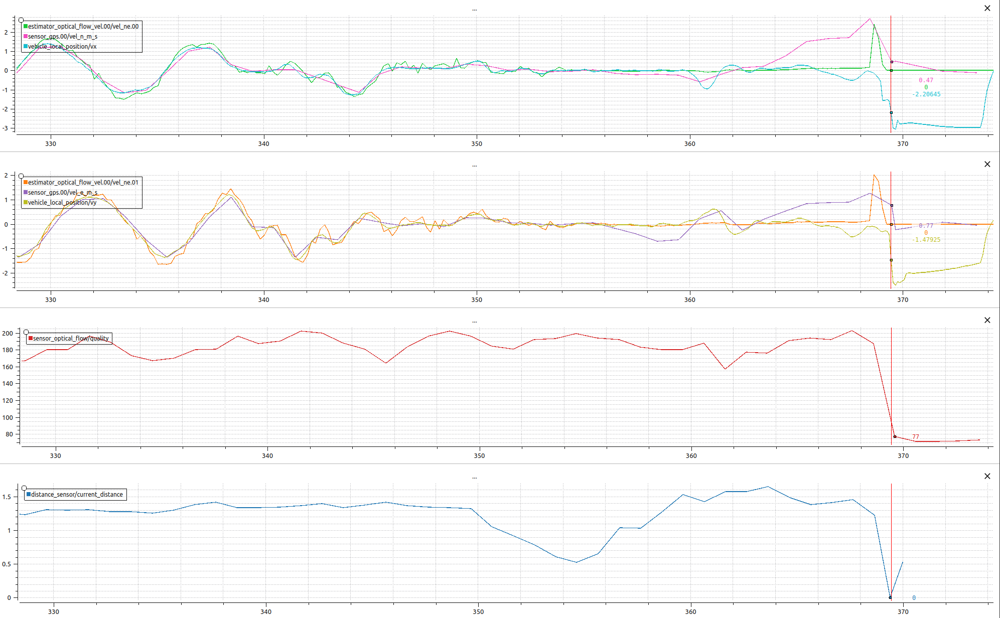
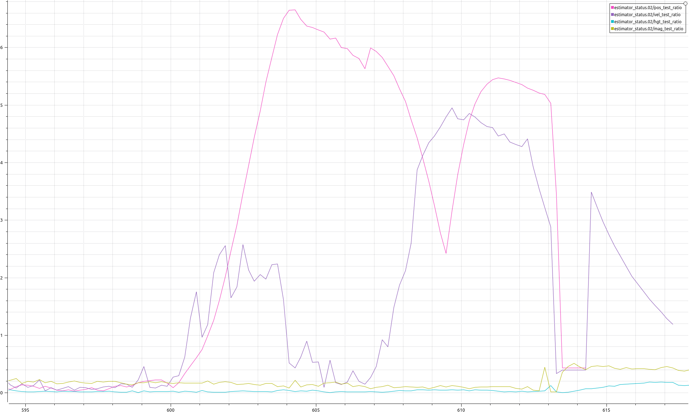
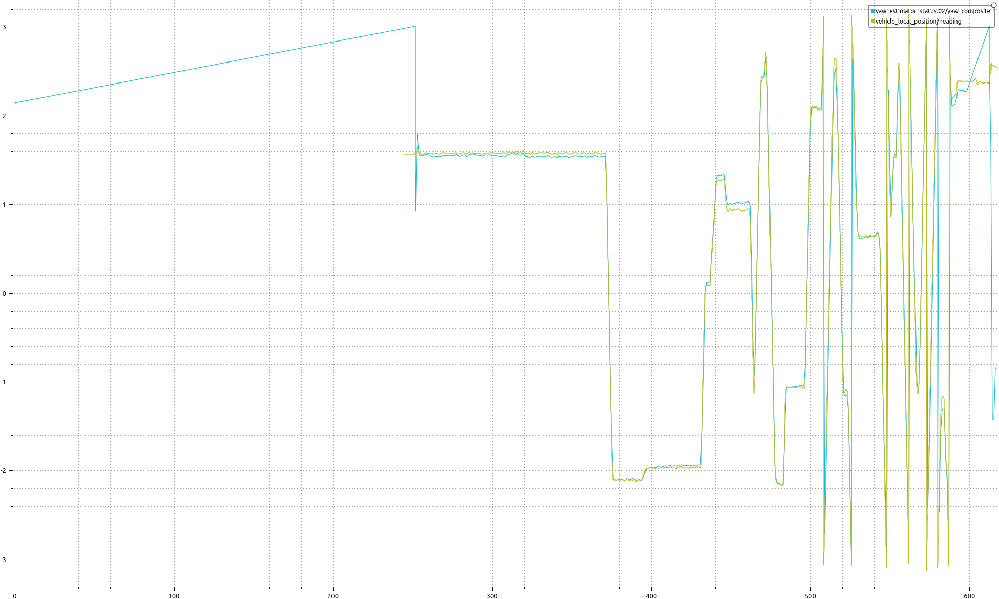
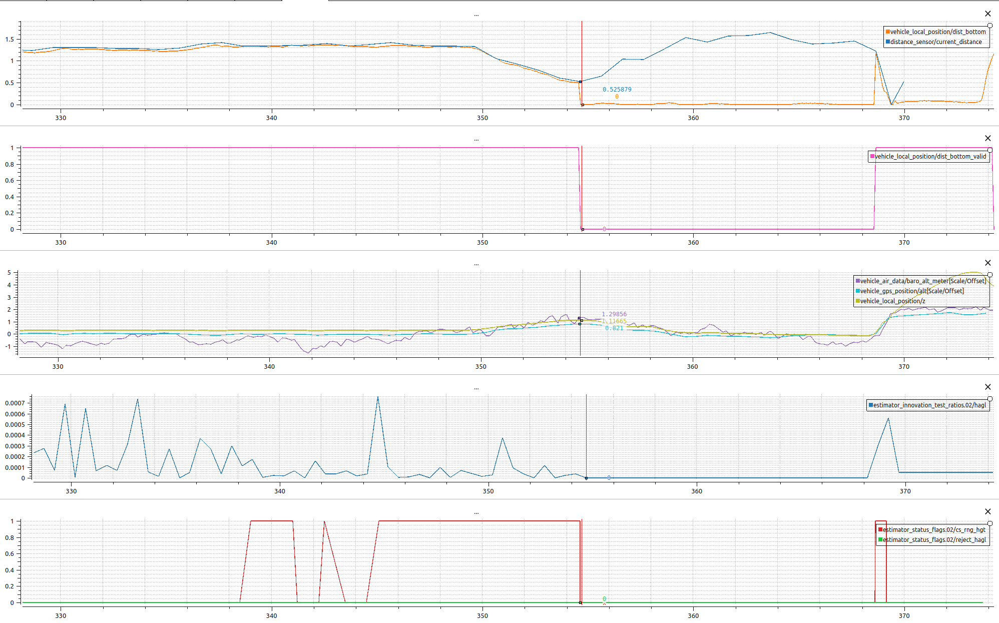

# Diagnositc workflow for an example Ulog output

Here is a possible workflow for checking major issues and flags from problematic flights. We reference [this issue](https://github.com/DroneLeaf/leaf_diag/issues/1) here as an example for understanding the reason for an estimator drift in the velocity estimate and subsequent crash.

* We first use the `estimator_selector_status/primary_instance` topic for identifying EKF2 instance number that was running at the time of analysis

    

    We can see that EKF2 instance 2 was selected during the flight

* Next, it is generally useful to investigate some of the position and velocity sensor signals and compare them with their estimates. We focus on the optical flow and GPS sensors here.
    * Useful sensor flags:
        * `estimator_status_flags.00/cs_gps`
        * `estimator_status_flags.00/cs_gps_hgt`
        * `estimator_status_flags.00/cs_opt_flow`
        * `estimator_status_flags.00/cs_rng_fault`
        * `estimator_status_flags.00/cs_rng_hgt`
        
        
        *Here is an example of the sensor flag values*

    * Sensor topics:
        * `estimator_optical_flow_vel.02/vel_ne.00`**
        * `estimator_optical_flow_vel.02/vel_ne.01`**
        * `sensor_gps/vel_n_m_s`: This is a debug optical flow signal with gyro, range correction and rotation to NED frame applied
        * `sensor_gps/vel_e_m_s`: This is a debug optical flow signal with gyro, range correction and rotation to NED frame applied
        * `sensor_optical_flow/quality`: Usually a quality above 100 indicates healthy operation
    * Estimator topics:
        * `vehicle_local_position/vx`
        * `vehicle_local_position/vy`

    
    *This is an example of how the above sensors can be compared with their estimates we can clearly see a divergence between the estimates and the sensor readings in the top two subplots*

* Sensor fusion topics: These topics are useful for diagnosing issues with sensor fusion and which signals where rejected by the EKF2 instance. We mostly look at innovation test ratios which are a normalised innovation given as:

    $$
    \mathrm{innovation}_\mathrm{ratio} \propto \dfrac{\mathrm{innovation}^2}{\mathrm{variance_\mathrm{observation}}^2}
    $$

	A test ratio > 1 indicates that the estimator rejects the sensor readings due to high observation variance.
	* GPS position test ratios**:
		* `estimator_innovation_test_ratios.02/gps_hpos.00`
		* `estimator_innovation_test_ratios.02/gps_hpos.01`
	* GPS velocity test ratios**:
		* `estimator_innovation_test_ratios.02/gps_hvel.00`
		* `estimator_innovation_test_ratios.02/gps_hvel.01`
	* Optical flow test ratios**:
		* `estimator_innovation_test_ratios.02/flow.00`
		* `estimator_innovation_test_ratios.02/flow.00`

	
    *In this example, we can see that GPS position, GPS velocity, and optical flow velocity are being rejected towards the end of the flight and the crash*

	* Other test ratios:
		* `estimator_status.02/hgt_test_ratio`
		* `estimator_status.02/mag_test_ratio`
		* `estimator_status.02/pos_test_ratio`
		* `estimator_status.02/vel_test_ratio`

    
    *In this example, we can see a similar pattern for each of the velocity, position, height, and magnetometer estimates*

* Yaw estimation debugging:
	* Sometimes it can be useful to check the heading and heading estimates for divergence as follows:
	* `yaw_estimator_status.02/yaw_composite`: Composite heading signal from magnetometer
	* `vehicle_local_position/heading`: Fused heading estimate

    
    *In this example we can see no issues with heading estimates and can rule out compass related issues*

* GPS dead reckoning:
	* `sensor_gps.00/s_variance_m_s`: To check the sensor variance
	* `estimator_status_flags.02/cs_inertial_dead_reckoning`
    
    
    *In this example we can see GPS dead reckoning activated leading up to the crash at 369 seconds*

	* It can also be useful to check that all EKF2 instances are estimating similar positions:

    
    *We can see no issues with individual estimators as they all seem to be tracking the same position estimates. This rules out issues with the estimators themselves*

* Optical flow issues: you need to check the altimeter readings and compare it to the terrain estimate. Wrong terrain estimates can lead to optical flow erroneous readings
	* Distance sensor estimate and reading:
		* `distance_sensor/current_distance`
		* `vehicle_local_position/dist_bottom`
	* Flags:
		* `vehicle_local_position/dist_bottom_valid`
	* Other z estimates:
		* `vehicle_air_data/baro_alt_meter`: Apply -10 offset and -1 multiplier
		* `vehicle_gps_position/alt`: Apply 26.45 offset and -0.001 multiplier
		* `vehicle_local_position/z`
	* `estimator_innovation_test_ratios.02/hagl`

    
    *We can see that in the range 359 - 369 we lose the terrain estimate completely which cause optical flow to no longer be computable (goes to zero) leading to its rejection and the velocity estimate drifting*

** : Please identify the correct EKF2 instance at the time of diagnosis by looking at the `estimator_selector_status/primary_instance` topic