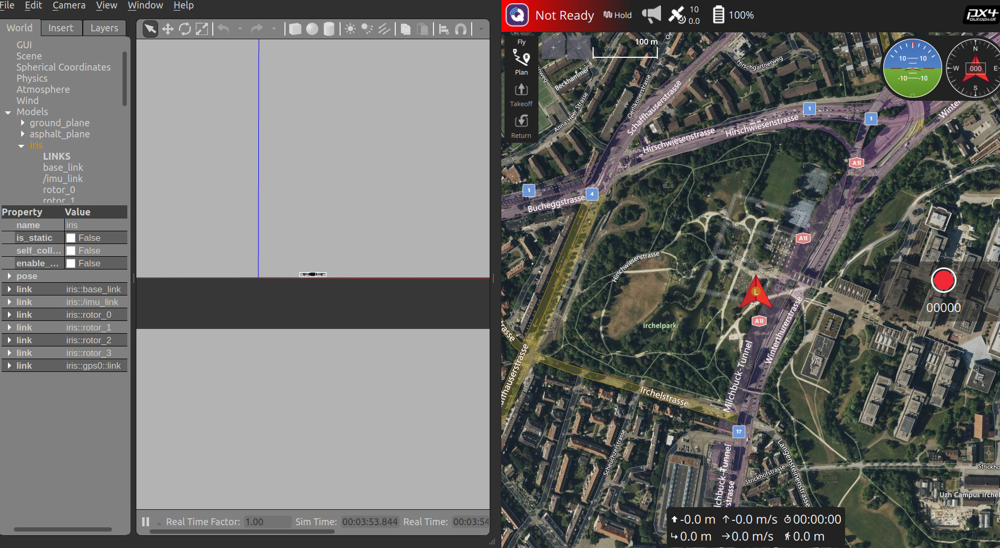
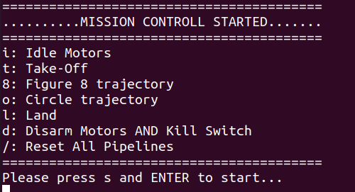

# Overview

> Disclaimer: This document is outdated and will be rewritten soon. Please refer to the new documentation at [DroneLeaf Developer Setup](../../HEAR%20Software/Operation/SITL/Readme.md).


The context of installation of DroneLeaf software depends on the user. As of now, there are two users for the installation process:

- DroneLeaf clients.
- DroneLeaf developers. There are two contexts for developers:
    - SITL Environment.
    - Deployment Environment.

The workflow of DroneLeaf clients is roughly a subset of the workflow for DroneLeaf developers.


## DroneLeaf developers

### Development Environnment

To get started witteh development and testing with HEAR software stack, you need to do the following steps:

#### 1 - Install HEAR_CLI
HEAR_CLI provides all the necessary programs that automate most of the scripts needed to get your setup and ready, and more

##### Clone and Install
    
```bash
git clone git@github.com:DroneLeaf/HEAR_CLI.git
cd HEAR_CLI
```

And follow the installation instruction inside HEAR_CLI README.md file.

##### Validate

You should be able to se a welcome message and some basic overview about the HEAR_CLI
    
```bash
hear-cli --help
```

#### 2 - Prepare Developer Machine program

##### prepare_developer_machine
Once you have the CLI installed, you can run the prepare program that will take care of seting up all dependencies and cloning and building all need repos for development

```bash
hear-cli local_machine run_program
# scroll dow with your down arrow key to navigate within available programs
# Select: prepare_developer_machine
```
this program will setup your machine for development.

Once the program is done, you should have the following repos cloned and built in your machine in the $HOME directory.

##### PX4-Autopilot
```bash
cd ~
git clone git@github.com:DroneLeaf/PX4-Autopilot.git
```

##### QGroundControl

Refer to this documentation and follow the installation steps: [QGroundControl](https://docs.qgroundcontrol.com/master/en/qgc-user-guide/getting_started/download_and_install.html)


### Your first SITL run!

As you have your machine ready for development and testing, let's run the SITL setup to play around the software stack.

#### 1 - PX4-Autopilot

```bash
cd PX4-Autopilot
make px4_sitl gazebo-classic
```
This will launch a gazeboo world that contains a drone instance, along with the px4 firmware running in SITL setup for this drone.

#### 2 - QGroundControl

Run the QGroundControl and connect to the PX4 SITL instance.

```bash
cd ~/Downloads # where you downloaded the QGroundControl AppImage
./QGroundControl.AppImage
```
You should see something similar to this:



**Note:** If you see the message "Ready To Fly" notlike the scrrenshot then you are good to go.

To fix "Not Ready" status in the QGroundControl, go to the terminal that you ran the px4_sitl command and run the following command:

```bash
pxh> ekf2 start
```
Then you should see the status "Ready To Fly" in QGroundControl.

#### 3 - HEAR_FC
As you have the PX4 SITL running and connected to QGroundControl, you can now run the HEAR_FC to simulate the drone's flight controller.

- Configure

    Head to ~/HEAR_Configurations/UAV_instances and edit the general.json file to match the following:

    ```json
    {
        "default_uav_instance_name": "",
        "Description": "Define default_uav_instance_name to enforce uav instance name on the current machine"
    }
    ```
- Run
    ```bash
    cd ~/HEAR_FC
    source devel/setup.bash
    roslaunch flight_controller px4_flight_mavlink_opti.launch
    ```

#### 4 - HEAR_MC
Now, HEAR_MC provides the CLI interface to perform messions and tasks on the drone. You can run the following command to start the HEAR_MC:

```bash
cd ~/HEAR_MC
source devel/setup.bash
roslaunch mission_control demo_fsac.launch
```
You should see something similar to this:



Yeah!! Your Good to go, have fun developing and testing with the HEAR software stack.