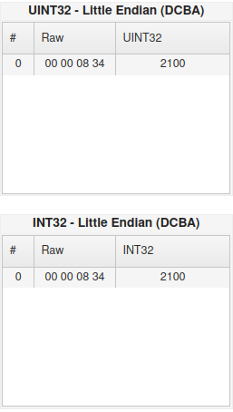

# QGC set actuator min/max inner working
## Sample dump for message to set actuator maximum range to 2100
Sent from QGC

Feedback from PX4:

Decoding using https://www.scadacore.com/tools/programming-calculators/online-hex-converter/:

## Sample dump for message to set actuator minimum range to 900
Sent from QGC

Feedback from PX4:

Decoded values:

# QGC motor test slider
Starting motor 1:
see how param5 float value is 1101. Format is 110x with x being motor index. param1 represent the motor throttle from 0 to 1. param2 represents timeout in seconds and has to be from 0-3 s. The message is sent repeatedly for every motor at high frequency to ensure timeout is not reached.

Stopping motor 3:
see how param5 float value is 1103. Format is 110x with x being motor index. param1 and param2 has to be nan (0x0000c07f) and 0 respectively. Every motor has to be stopped individually.

# Set actuator output type:
Setting output type to `PWM 400 Hz`:

Decoded param_value from `0x09010000`:

# Set Aux x to Motor x:
Example of setting Aux 5 to Motor 5:

Decoding of `param_value` of `0x69000000` is 105 in UINT32 and INT32 Little Endian (DCBA)

Additional example of setting Aux 6 to Motor 6:
