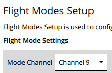
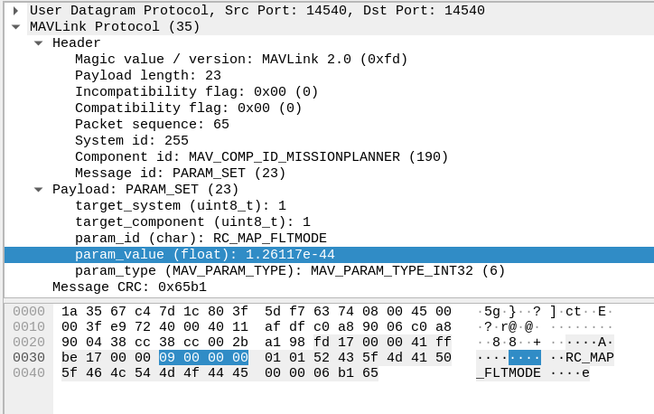
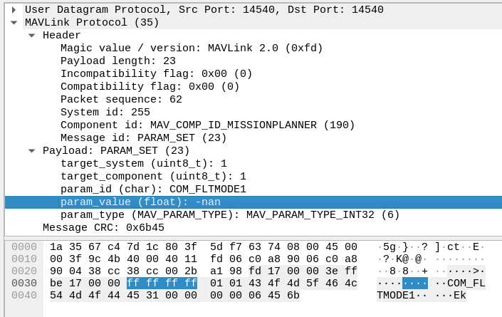
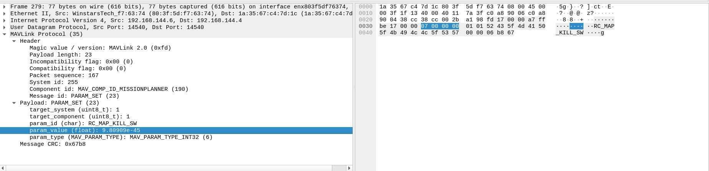

# Set flight mode channel
From QGC:

Decoding using https://www.scadacore.com/tools/programming-calculators/online-hex-converter/:
Decoding of `param_value` of `0x09000000` is 9 in UINT32 and INT32 Little Endian (DCBA)

# Setting Flight Mode 1 to Unassigned
Same for Flight Mode 1 to Flight Mode 6

# Kill-switch assignment message
