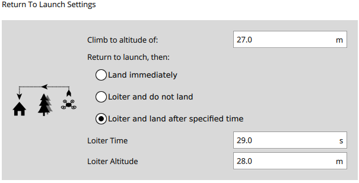

# Return to launch settings

## Set of "Climb to altitude of"
Payload: PARAM_SET (23)

param_id (char): RTL_RETURN_ALT
param_value (float): 27 // 27 meters, raw 0x0000d841
param_type (MAV_PARAM_TYPE): MAV_PARAM_TYPE_REAL32 (9) // 32-bit little endian

## Change mode across "Land Immediately", "Loiter and do not land", "Loiter and land after specified time"

**Behavior is controlled by `RTL_LAND_DELAY` value as follows:**

Payload: PARAM_SET (23)
param_type (MAV_PARAM_TYPE): MAV_PARAM_TYPE_REAL32 (9)
param_id (char): RTL_LAND_DELAY

- "Land Immediately":
param_value (float): 0

- "Loiter and do not land":
param_value (float): -1

- "Loiter and land after specified time":
param_value (float): 60 // for 60 seconds loitering

## Setting "Loiter Altitude":
Payload: PARAM_SET (23)
param_type (MAV_PARAM_TYPE): MAV_PARAM_TYPE_REAL32 (9)
param_id (char): RTL_DESCEND_ALT
param_value (float): 28 // for 28 meters