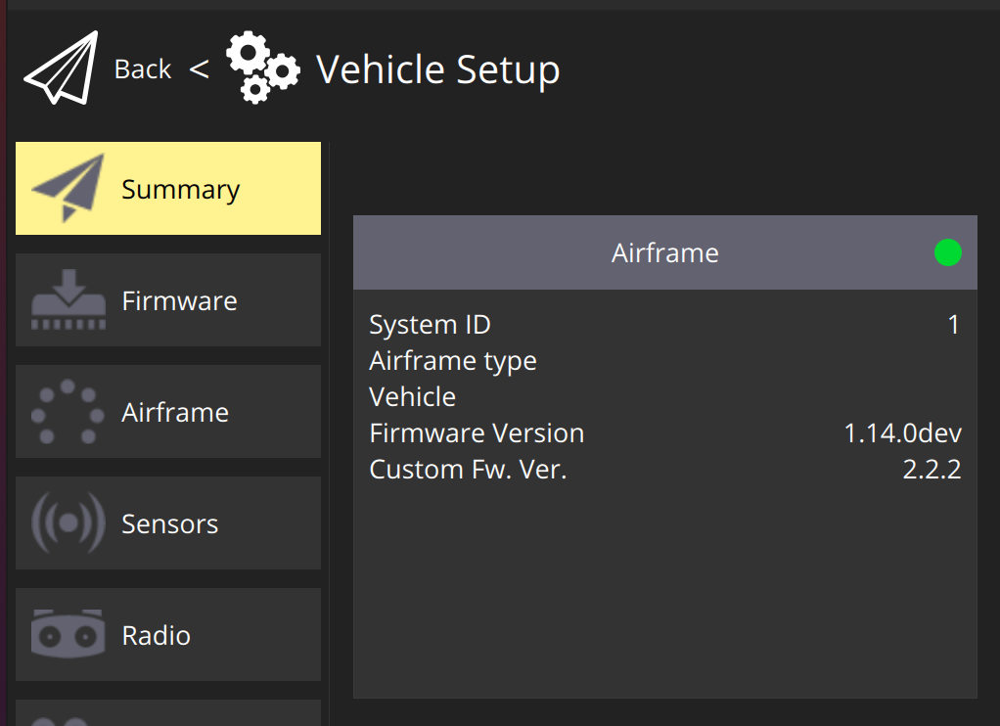

# Overview
We need to have internal versioning independent of PX4 versioning. This is possible in PX4: https://docs.px4.io/main/en/dev_setup/building_px4.html#firmware-version-git-tags

## How To
On our repo branch (https://github.com/DroneLeaf/PX4-Autopilot) publish a tag with the following format: `vx.y.z-a.b.c` where `x.y.z` are numbers that would show in the "Firmware Version" field under the "Airframe" card in QGC "Summary" tab. In the same card `a.b.c` would show in the "Custom Fw. Ver." field. For example, when publishing a tag `v1.14.0-2.2.2` the following is shown in QGC:

**Note:** before compiling the PX4-Autopilot firmware you need to `fetch` the remote repo with the relevant tags.