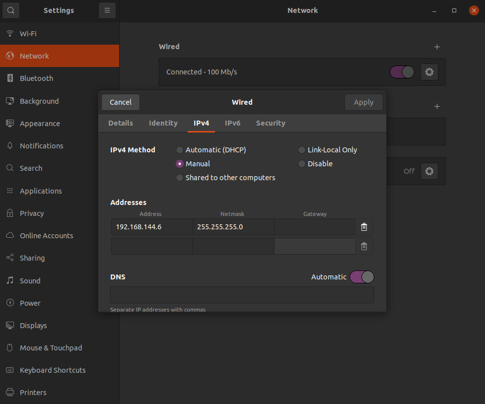

# Overview

This document describes how to test the software stack in the actual hardware and run the PX4 in the drone.


## DroneLeaf developers

You first need to build the PX4 Autopilot and upload it to the drone to be tested.

#### 1 - Building PX4-Autopilot

To install the pre-requisites in order to build the PX4:

```bash
cd ~/software-stack/PX4-Autopilot
sudo ./Tools/setup/ubuntu.sh
```
This will install all the dependencies to successfully build the PX4-Autopilot.

Now, we need to compile the PX4-Autopilot

```bash
make px4_fmu-v6x_default
```

If the PX4 is compiled successfully, we are ready to upload.
The build is saved inside the following directory:
```bash
~/software-stack/PX4-Autopilot/build/px4_fmu-v4_default
```

#### 2 - Upload the Build to the Drone 

1) First, you need to connect the drone to your computer with a USB-C cable. Make sure that the drone is not powered by another external power source. It needs to be only powered by the USB.
2) Open the LeafMC and go to the Vehicle Setup.
3) Click on Firmware and follow the instructions to upload the firmware.
4) When the upload window pops up, select advanced settings.
5) In the advanced settings, at the bottom of the window, there is a dropdown menu to select the firmware to be uploaded.
6) In that menu, select external firmware file and choose the build in the directory given in the previous section.
7) If the upload is completed, go to Parameters tab from the left menu and set SYS_AUTOSTART parameter to 4951.
8) Now, you can disconnect the USB-C and power up the drone with an external power source.

#### 3 - Ethernet Connection
Now, connect the drone with ethernet cable to your computer and set a static IP. Go to your computer's wired connection setting and set the manual IP as follows



#### 4 - Mavlink Router

Now, we need to configure the Mavlink Router in order to commmunicate with the drone. Run the following codes to successfully configure the mavlink router.

```bash
sudo mkdir -p /etc/mavlink-router/
```

```bash
sudo touch /etc/mavlink-router/main.conf
printf ' \n
## UART setup \n
#[UartEndpoint pixhawk] \n
#Device = /dev/ttyS0 \n
#Baud = 52000  \n
\n
[UdpEndpoint client] \n
Mode = Normal \n
Address = 0.0.0.0 \n
Port = 11000 \n
\n
[UdpEndpoint server] \n
Mode = Server \n
Address = 0.0.0.0 \n
Port = 10000
' | sudo tee /etc/mavlink-router/main.conf
```

After the configuration, before launching LeafMC and LeafFC, we need to run the following command.
```bash
mavlink-routerd 0.0.0.0:14540
```
After successful execution, please make sure your settings are the same as the output below.
```
Opened UDP Server [4]server: 0.0.0.0:10000
Opened UDP Client [5]client: 0.0.0.0:11000
Opened UDP Server [7]CLI: 0.0.0.0:14540
Opened TCP Server [8] [::]:5760
```
If everything is correct, you can continue to the next step.

#### 5 - HEAR_Configurations
You also need to setup the configurations before runing the HEAR_FC. There are a couple of settings you have to make sure that setup correctly.

- Systems/Pixhawk
- UAV_instances

Head to ~/HEAR_Configurations/Systems/Pixhawk/ and edit the general.json file to match the following:

```json
{
    "pixhawk_ip": "127.0.0.1",
    "pixhawk_udp_port": 10000,
    "local_ethernet_interface_ip": "127.0.0.1",
    "local_udp_port": 14541,
    "serial_port_addr":"/dev/ttyS0",
    "serial_baud_rate":921600
}
```
You need to set the "pixhawk_ip" and "local_ethernet_interface_ip" to your local IP.

After setting up the Pixhawk configuration, you need to check the general.json file in ~/HEAR_Configurations/UAV_instances/ and edit the "default_uav_instance_name" according to the drone instance that you want to test.

```json
{
    "default_uav_instance_name": "X500_TF40d_Test",
    "Description": "Define default_uav_instance_name to enforce uav instance name on the current machine"
}
```
#### 6 - Leaf FC
You can now run the LeafFC

- Run
    ```bash
    cd ~/software-stack/HEAR_FC
    source devel/setup.bash
    roslaunch flight_controller px4_flight_mavlink_opti.launch
    ```

#### 7 - Leaf MC

Download QGC
https://droneleafworkspace.slack.com/files/U080N4HR8HG/F086D7BCQQ7/leafmc.appimage


Run the app image to open the Leaf MC (QGC).

```bash
cd ~/Downloads # where you downloaded the QGroundControl AppImage
./LeafMC.AppImage
```
Finally, you should see "PX4 Ready to Fly" message on the QGC and you are good to go!