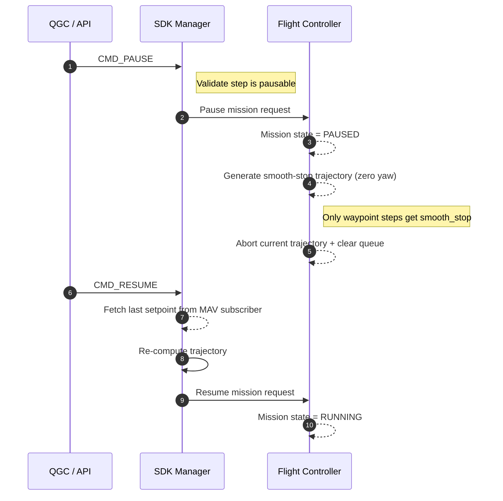
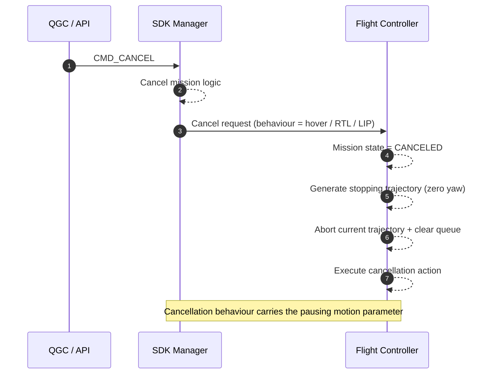
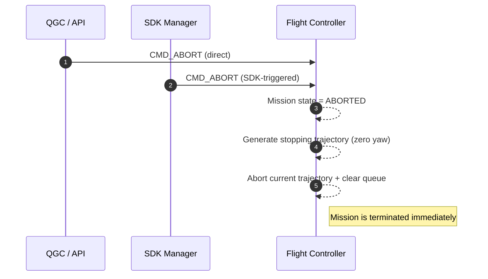
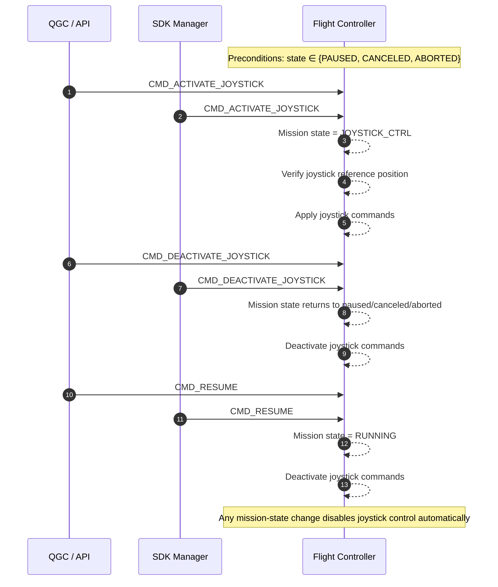
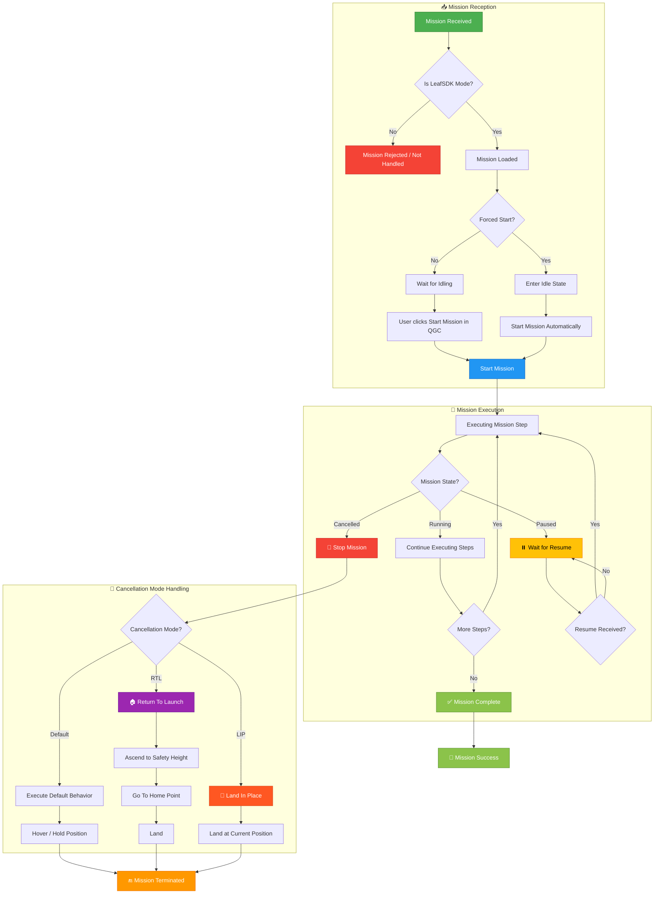

# SDK Mission Mode Pause / Resume / Cancel / Manual Control (Mermaid)

<!-- Note: This is early draft that is not correct. Correction would follow in the upcoming commits. -->

_Source diagram: `Guide/HEAR Software/Flight Modes/SDK Mission Mode Pause Resume and Cancel Workflow and System Level Interractions.drawio`_

Each section below mirrors a lane in the original Draw.io diagram. The "Breakpoints" list is written so you can quickly re-create or tweak the Mermaid drawing without re-reading the XML.

---

## Pause & Resume Flow

**Breakpoints**
1. QGC issues `CMD_PAUSE`; SDK verifies whether the current step is pausable or schedules a pause at the next waypoint end.
2. SDK tells the FC to pause the mission; the FC marks the mission state as **PAUSED**.
3. FC computes a smooth-stop trajectory (zero yaw) for waypoint steps, aborts the current trajectory, and clears any queued setpoints (non-waypoint steps may simply halt).
4. When QGC sends `CMD_RESUME`, the SDK grabs the last setpoint from the MAV subscriber, re-computes a trajectory, and resumes the mission at the FC, switching the state back to **RUNNING**.

---

## Cancel Flow

**Breakpoints**
1. Operator sends `CMD_CANCEL`; SDK switches the mission into cancel mode.
2. SDK forwards cancellation parameters (hover, RTL, land-in-place, etc.) plus the desired pausing motion behavior to the FC.
3. FC transitions to **CANCELED**, generates a stopping trajectory, aborts any active trajectory/queue, and executes the requested cancellation action.

---

## Abort Flow

**Breakpoints**
1. `CMD_ABORT` from QGC goes _directly_ to the flight controller; SDK may also raise `CMD_ABORT` toward the FC (for example, due to safety logic).
2. Regardless of the origin, the FC marks the mission state as **ABORTED**, generates a stopping trajectory, aborts any remaining queue, and terminates the mission.

---

## Manual Joystick Control Flow

**Breakpoints**
1. Precondition: mission state is `PAUSED`, `CANCELED`, or `ABORTED`.
2. `CMD_ACTIVATE_JOYSTICK` can be initiated either by QGC or by the SDK; in both cases the command reaches the FC, which switches to **JOYSTICK_CTRL**, verifies stick positions, and starts consuming joystick inputs.
3. `CMD_DEACTIVATE_JOYSTICK` and `CMD_RESUME` can likewise originate from QGC or SDK. After the FC resets the mission state (back to paused/canceled/aborted or running), it explicitly executes a "Deactivate joystick commands" step so no manual inputs linger.

---

## Mission Reception & Execution Flowchart

This flowchart illustrates the complete lifecycle from mission reception through execution, including all decision points for LeafSDK mode, forced execution, pause/resume, and cancellation behaviors.

### Flowchart Legend

| Symbol | Meaning |
|--------|---------|
| 📥 | Mission Reception Phase |
| 🚀 | Mission Execution Phase |
| ⏸️ | Paused State |
| 🛑 | Cancelled/Stopped |
| 🏠 | Return To Launch (RTL) |
| 📍 | Land In Place (LIP) |
| ✅ | Mission Complete |
| 🔚 | Mission Terminated |

### Key Decision Points

1. **LeafSDK Mode Check**: Only LeafSDK missions are processed through this flow
2. **Forced Start**: 
   - **Forced = Yes**: Mission starts automatically after entering idle
   - **Forced = No**: User must manually trigger start via QGC button
3. **Cancellation Modes**:
   - **Default**: Hover in place / hold position
   - **RTL**: Ascend → Navigate home → Land
   - **LIP (Land In Place)**: Immediate landing at current position

---

These Mermaid snippets track one-to-one with the Draw.io swim lanes, so you can re-run or tweak them whenever the workflow evolves without needing to manually edit the original diagram.
