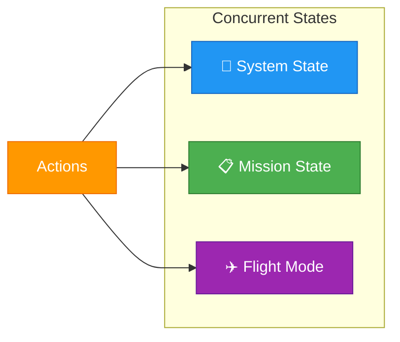
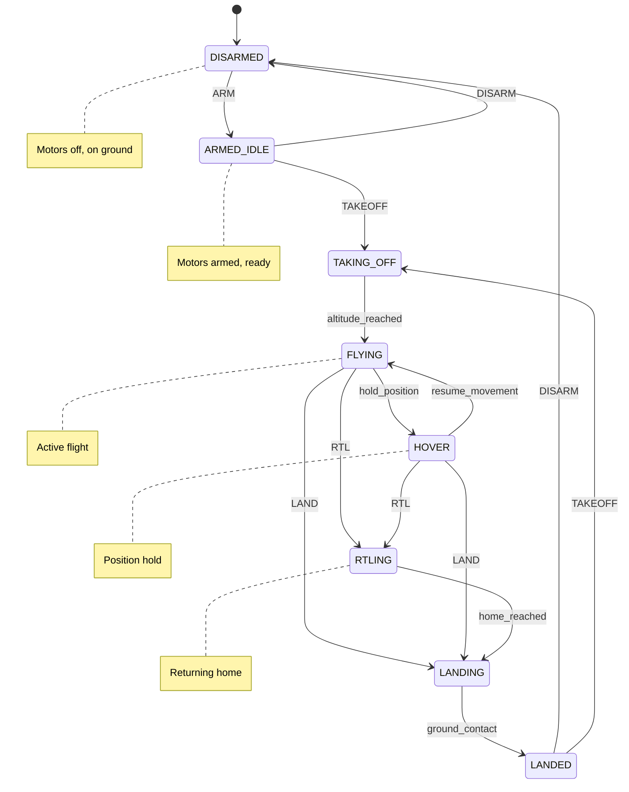
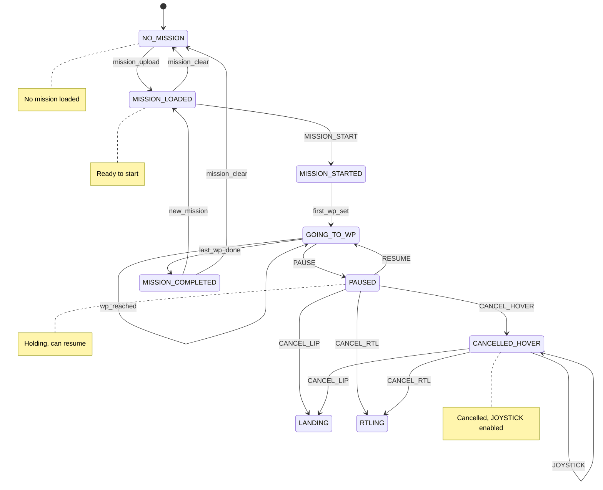
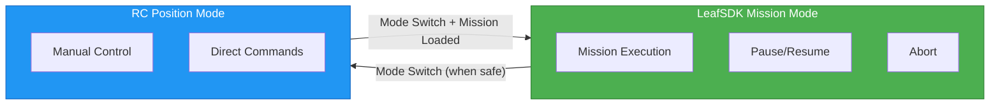

# LeafSDK Flight Mode State Machine Design

<!-- Note: This is early draft that is not correct. Correction would follow in the upcoming commits. -->

This document defines the dual-state machine for the LeafSDK flight system.

---

## State Architecture Overview

---

## 1. System States (Aircraft Physical State)

| ID | State | Description |
|----|-------|-------------|
| S01 | `DISARMED` | Motors off, on ground |
| S02 | `ARMED_IDLE` | Motors armed, ready for commands |
| S03 | `TAKING_OFF` | Ascending from ground |
| S04 | `FLYING` | In active flight |
| S05 | `HOVER` | Holding position in air |
| S06 | `LANDING` | Descending to ground |
| S07 | `LANDED` | On ground, motors may be armed |
| S08 | `RTLING` | Returning to launch point |

---

## 2. Mission States (Mission Execution State)

| ID | State | Description |
|----|-------|-------------|
| M01 | `NO_MISSION` | No mission loaded |
| M02 | `MISSION_LOADED` | Mission loaded, not started |
| M03 | `MISSION_STARTED` | Mission actively executing |
| M04 | `GOING_TO_WP{X}` | Navigating to waypoint X |
| M05 | `PAUSED` | Mission paused, can resume or cancel |
| M06 | `CANCELLED_HOVER` | Mission cancelled, hovering, JOYSTICK enabled |
| M07 | `MISSION_COMPLETED` | All waypoints completed |

---

## 3. Flight Modes

| ID | Mode | Description |
|----|------|-------------|
| F01 | `LeafSDK_Mission` | SDK-controlled mission mode |
| F02 | `RC_Position` | Manual RC control mode |

---

## 4. Actions Reference

| ID | Action | Target State | Description |
|----|--------|--------------|-------------|
| A01 | `ARM` | System | Arm the motors |
| A02 | `DISARM` | System | Disarm the motors |
| A03 | `TAKEOFF` | System | Begin takeoff sequence |
| A04 | `LAND` | System | Begin landing sequence |
| A05 | `RTL` | System | Return to launch |
| A06 | `PAUSE` | Mission | Pause current mission |
| A07 | `RESUME` | Mission | Resume paused mission |
| A08 | `CANCEL` | Mission | Cancel mission (see modes below) |
| A09 | `IDLE` | Mission | Enter idle state |
| A10 | `MISSION_START` | Mission | **Compound action** (see below) |
| A11 | `GOTO_WAYPOINT` | Mission | Navigate to specific WP |
| A12 | `GOTO_LOCATION` | Mission | Navigate to GPS location |
| A13 | `HOME_CHANGE` | System | Update home position |
| A14 | `JOYSTICK` | Manual | Enable joystick control |

### Cancel Modes

| Mode | Behavior |
|------|----------|
| `CANCEL_LIP` | Land In Place - land at current position |
| `CANCEL_RTL` | Return To Launch - ascend → go home → land |
| `CANCEL_HOVER` | Hover - hold position, enables JOYSTICK |

> [!IMPORTANT]
> **PAUSE → LAND** is actually **CANCEL_LIP** (Cancel + Land In Place)  
> **PAUSE → JOYSTICK** requires **CANCEL_HOVER** first (Cancel to Hover, then enable Joystick)

### MISSION_START Compound Action

`MISSION_START` is a **compound action** consisting of:

1. **Load Mission** - Load mission from the planned QGC mission
2. **IDLE** - If not already idle, enter idle state
3. **Start Mission** - Begin mission execution

---

## 5. State Transition Matrix

### Legend
- ✅ **Allowed** - Action can be executed
- ❌ **Blocked (UI)** - Button hidden/disabled in UI
- ⚠️ **Validation** - Backend validation required
- 🔧 **Dev Needed** - Requires implementation

---

### From `DISARMED` System State

| Mission State | ARM | TAKEOFF | LAND | RTL | PAUSE | RESUME | ABORT | MISSION_START |
|---------------|-----|---------|------|-----|-------|--------|-------|---------------|
| `NO_MISSION` | ✅→ARMED_IDLE | ❌ | ❌ | ❌ | ❌ | ❌ | ❌ | ❌ |
| `MISSION_LOADED` | ✅→ARMED_IDLE | ❌ | ❌ | ❌ | ❌ | ❌ | ❌ | ✅⚠️ |
| `MISSION_COMPLETED` | ✅→ARMED_IDLE | ❌ | ❌ | ❌ | ❌ | ❌ | ❌ | ❌ |

---

### From `ARMED_IDLE` System State

| Mission State | ARM | DISARM | TAKEOFF | LAND | RTL | PAUSE | RESUME | ABORT | MISSION_START |
|---------------|-----|--------|---------|------|-----|-------|--------|-------|---------------|
| `NO_MISSION` | ❌ | ✅→DISARMED | ❌ | ❌ | ❌ | ❌ | ❌ | ❌ | ❌ |
| `MISSION_LOADED` | ❌ | ✅→DISARMED | ✅→TAKING_OFF | ❌ | ❌ | ❌ | ❌ | ❌ | ✅→MISSION_STARTED |
| `MISSION_COMPLETED` | ❌ | ✅→DISARMED | ❌ | ❌ | ❌ | ❌ | ❌ | ❌ | ✅ (restart) |

---

### From `FLYING` System State

| Mission State | PAUSE | RESUME | CANCEL_LIP | CANCEL_RTL | CANCEL_HOVER | GOTO_WP | JOYSTICK |
|---------------|-------|--------|------------|------------|--------------|---------|----------|
| `GOING_TO_WP` | ✅→PAUSED | ❌ | ❌ | ❌ | ❌ | ✅ | ❌ |
| `PAUSED` | ❌ | ✅→GOING_TO_WP | ✅→LANDING | ✅→RTLING | ✅→HOVER | ❌ | ❌ |
| `CANCELLED_HOVER` | ❌ | ❌ | ✅→LANDING | ✅→RTLING | ❌ | ❌ | ✅ |

---

### From `HOVER` System State

| Mission State | PAUSE | RESUME | CANCEL_LIP | CANCEL_RTL | CANCEL_HOVER | GOTO_WP | JOYSTICK |
|---------------|-------|--------|------------|------------|--------------|---------|----------|
| `GOING_TO_WP` | ✅→PAUSED | ❌ | ❌ | ❌ | ❌ | ✅ | ❌ |
| `PAUSED` | ❌ | ✅→GOING_TO_WP | ✅→LANDING | ✅→RTLING | ✅ (stay HOVER) | ❌ | ❌ |
| `CANCELLED_HOVER` | ❌ | ❌ | ✅→LANDING | ✅→RTLING | ❌ | ❌ | ✅ |
| `MISSION_COMPLETED` | ❌ | ❌ | ✅→LANDING | ✅→RTLING | ❌ | ❌ | ❌ |

---

### From `LANDING` System State

| Mission State | ARM | DISARM | TAKEOFF | LAND | RTL | PAUSE | RESUME | ABORT |
|---------------|-----|--------|---------|------|-----|-------|--------|-------|
| `ANY` | ❌ | ❌ | ❌ | ❌ | ❌ | ⚠️🔧 | ⚠️🔧 | ✅→ABORTED |

> [!NOTE]
> PAUSE during LANDING requires careful handling - may need to abort landing and hover.

---

### From `LANDED` System State

| Mission State | ARM | DISARM | TAKEOFF | LAND | RTL | PAUSE | RESUME | ABORT | IDLE | MISSION_START |
|---------------|-----|--------|---------|------|-----|-------|--------|-------|------|---------------|
| `MISSION_LOADED` | ❌ | ✅→DISARMED | ✅→TAKING_OFF | ❌ | ❌ | ❌ | ❌ | ❌ | ✅ | ✅→MISSION_STARTED |
| `MISSION_COMPLETED` | ❌ | ✅→DISARMED | ❌ | ❌ | ❌ | ❌ | ❌ | ❌ | ✅ | ❌ |
| `ABORTED` | ❌ | ✅→DISARMED | ❌ | ❌ | ❌ | ❌ | ❌ | ❌ | ✅→MISSION_LOADED | ❌ |

---

### From `RTLING` System State

| Mission State | ARM | DISARM | TAKEOFF | LAND | RTL | PAUSE | RESUME | ABORT | JOYSTICK |
|---------------|-----|--------|---------|------|-----|-------|--------|-------|----------|
| `ANY` | ❌ | ❌ | ❌ | ❌ | ❌ | ✅→PAUSED | ❌ | ✅→ABORTED | ❌ |

> [!WARNING]
> JOYSTICK control during RTL requires validation - safety concern.

---

## 6. Development Notes

### 🔧 Items Requiring Implementation

| ID | System State | Mission State | Action | Note |
|----|--------------|---------------|--------|------|
| D01 | LANDING | ANY | PAUSE | Need to handle gracefully - abort landing or reject? |
| D02 | RTLING | ANY | JOYSTICK | Safety validation required before allowing |
| D03 | ANY | MISSION_COMPLETED | MISSION_START | Does this restart same mission or require new upload? |
| D04 | FLYING | PAUSED | GOTO_LOCATION | May need to implement for manual override |

### ❓ Open Questions

1. When PAUSED, should GOTO_WAYPOINT resume from that point or mark current WP as skipped?
2. Does ABORT during TAKING_OFF trigger immediate LAND or HOVER?
3. Can HOME_CHANGE be performed while in FLYING state?

---

## 7. Mode Switching Rules

### Mode Switch Conditions

| From | To | Allowed When | Blocked When |
|------|-----|--------------|--------------|
| `LeafSDK_Mission` | `RC_Position` | PAUSED, ABORTED, MISSION_COMPLETED | GOING_TO_WP (mid-execution) |
| `RC_Position` | `LeafSDK_Mission` | MISSION_LOADED, HOVER | NO_MISSION |

---

*Last Updated: 2025-12-08*
