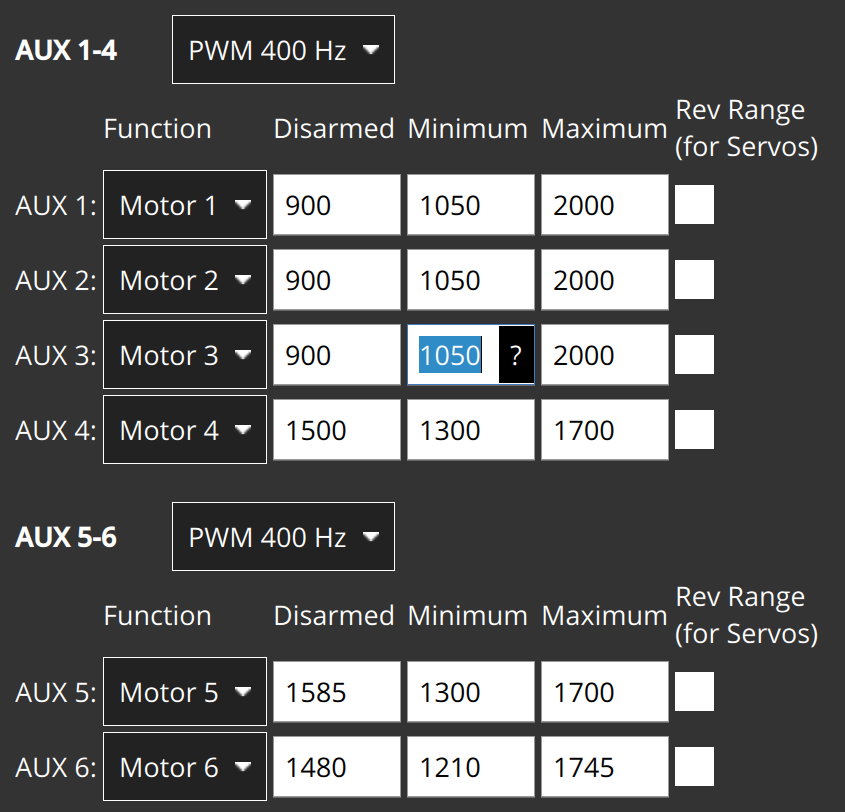
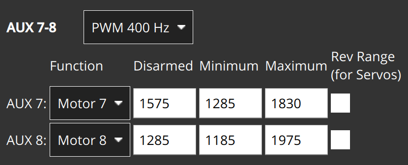
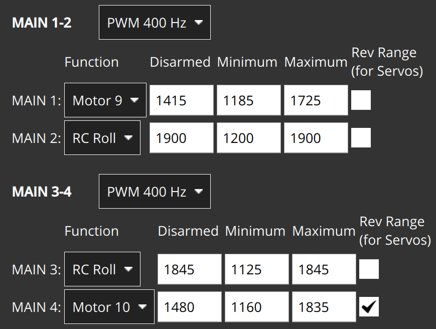
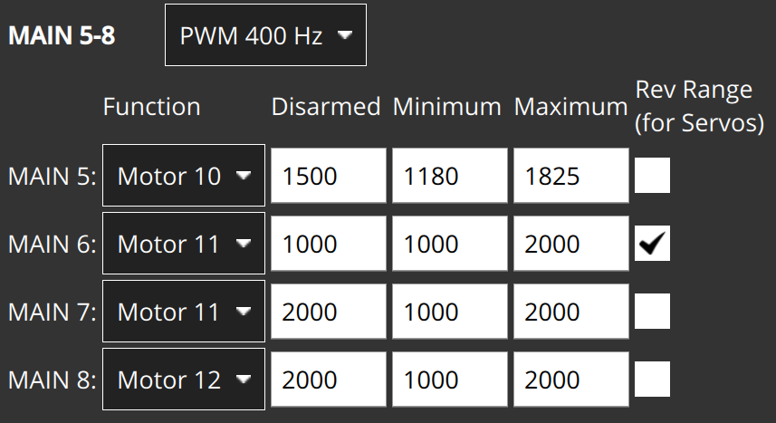
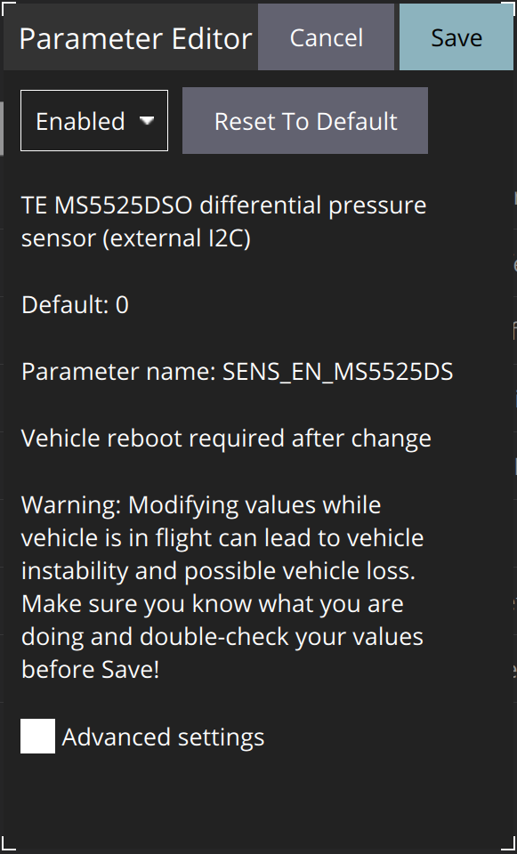
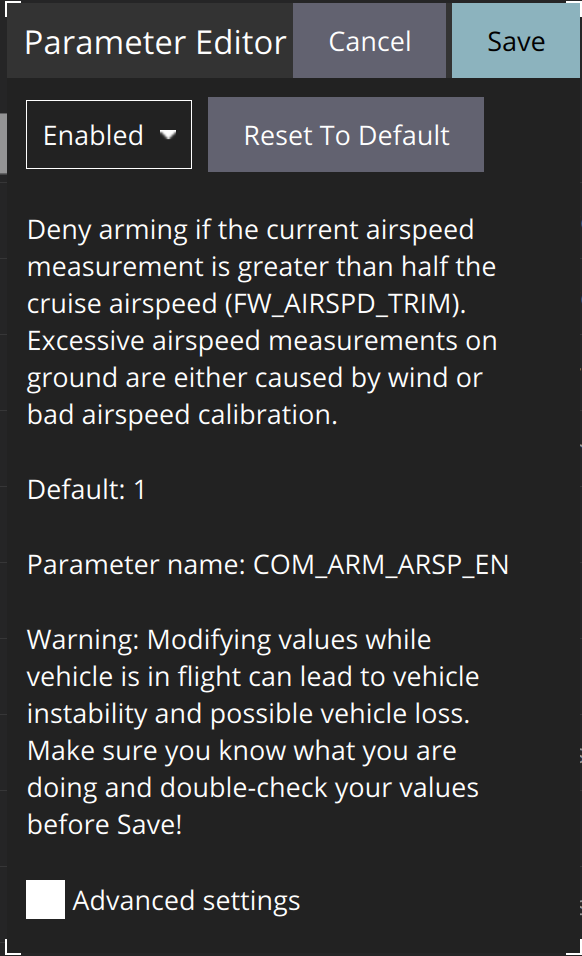

# Manual Transition Flight Design Sketch

The general system archeticture is given as follows:

# Convention
This convention is what to expect when moving knobs in QGroundControl after performing all PX4 settings mentioned below.

# PX4 Settings
## Physical Asset assignment
| **Reference** | **Function**  | **Pixhawk Pin** | **Signal Source**  |
|---------------|---------------|-----------------|--------------------|
| **M1**        | Front Motor   | AUX 1           | OFFBOARD MAVLink 1 |
| **M2**        | Rear Motor R  | AUX 2           | OFFBOARD MAVLink 2 |
| **M3**        | Rear Motor L  | AUX 3           | OFFBOARD MAVLink 3 |
| **S4**        | Canard R      | AUX 4           | OFFBOARD MAVLink 4 |
| **S5**        | Canard L      | AUX 5           | OFFBOARD MAVLink 5 |
| **S6**        | Vane R        | AUX 6           | OFFBOARD MAVLink 6 |
| **S7**        | Vane L        | AUX 7           | OFFBOARD MAVLink 7 |
| **S8**        | M1 Tilt Servo | AUX 8           | OFFBOARD MAVLink 8 |
| **S9**        | Rudder R      | MAIN 1          | RC Yaw             |
| **S10**       | Rudder L      | MAIN 1          | RC Yaw             |
| **S11**       | Aileron R     | MAIN 2          | RC ROLL            |
| **S12**       | Aileron L     | MAIN 3          | RC ROLL            |
| **S13**       | Elevator R    | MAIN 4          | OFFBOARD MAVLink 9 |
| **S14**       | Elevator L    | MAIN 5          | OFFBOARD MAVLink 10|
| **S15**       | Steering      | RC Direct       | RC AUX 1           |
| **S16**       | Door R/R      | MAIN 6          | OFFBOARD MAVLink 11|
| **S17**       | Door R/L      | MAIN 8          | OFFBOARD MAVLink 12|
| **S18**       | Door L/R      | MAIN 8          | OFFBOARD MAVLink 12|
| **S19**       | Door L/L      | MAIN 7          | OFFBOARD MAVLink 11|

## Actuation PX4 settings
Maximum/Minimum limits for each actuator are set in the QGC. See QGC screenshots below.

# RC Settings
Used Controller is Futaba T14SG. ID: T14SG-01.
## RC Channel assignment
See `Systems/RC/general.json` for updated HEAR configuration.

| **RC Channel** | **PX4 Assignment** | **Used in HEAR FC** | **Futaba T14SG Assignment** |
|----------------|--------------------|---------------------|-----------------------------|
| **CH1**        | RC ROLL            | Yes                 | J1                          |
| **CH2**        | RC PITCH           | Yes                 | J2                          |
| **CH3**        | RC THROTTLE        | Yes                 | J3                          |
| **CH4**        | RC YAW             | Yes                 | J4                          |
| **CH5**        |                    |                     |                             |
| **CH6**        |                    | Yes (CH_number_for_forward_motion)   | RS                          |
| **CH7**        |                    |                     |                             |
| **CH8**        | RC AUX 2           | Yes (CH_number_for_switch_vtol_mode)                | SA                          |
| **CH9**        |                    |                     |                             |
| **CH10**       | RC AUX 1           |                     | LD                          |
| **CH11**       | Kill switch        |                     | SF                          |
| **CH12**       |                    |                     |                             |

## RC Switches Settings
| RC Switch/Knob 	| Max Val 	| Min Val 	| Max Val Pos 	| Min Val Pos 	|
|----------------	|---------	|---------	|-------------	|-------------	|
| CH1            	| +100    	| -100    	| West        	| East        	|
| CH2            	| +100    	| -100    	| North       	| South       	|
| CH3            	| +100    	| -100    	| North       	| South       	|
| CH4            	| +100    	| -100    	| West        	| East        	|
| CH6            	| +100    	| -100    	| South       	| North       	|
| CH8            	| +140    	| 0       	| South       	| Middle      	|
| CH10           	| +100    	| -100    	| East        	| West        	|
| CH11           	| +100    	| -100    	| South       	| North       	|

* Top of the RC points north
## RC PX4 settings

# Surfaces and Servos calibration
## Calibration values

| Actuator 	| Positive Set Angle Limit 	| Negative Set Angle Limit 	| Positive Mechanical Limit 	| Negative Mechanical Limit 	| PWM at the Positive Set Angle 	| PWM at the Negative Set Angle 	| PWM at the Positive Mechanical Limit 	| PWM at the Negative Mechanical Limit 	| Zero Angle Reference wrt datum 	|
|----------	|--------------------------	|--------------------------	|---------------------------	|---------------------------	|-------------------------------	|-------------------------------	|--------------------------------------	|--------------------------------------	|--------------------------------	|
| S6       	| 30                       	| 30                       	|                           	|                           	|                               	|                               	|                                      	|                                      	|                                	|
| S7       	| 30                       	| 30                       	|                           	|                           	|                               	|                               	|                                      	|                                      	|                                	|
| S8       	| 7                        	| 33                       	|                           	| 11                        	|                               	|                               	|                                      	|                                      	|                                	|
| S11      	| 22                       	| 22                       	|                           	|                           	|                               	|                               	|                                      	|                                      	|                                	|
| S12      	| 22                       	| 22                       	|                           	|                           	|                               	|                               	|                                      	|                                      	|                                	|
| S13      	| 18                       	| 18                       	|                           	|                           	|                               	|                               	|                                      	|                                      	|                                	|
| S14      	| 18                       	| 18                       	|                           	|                           	|                               	|                               	|                                      	|                                      	|                                	|
* For PWM limits corresponding to the physical angle limits, refer to the PX4 actuator settings panes above.
* All angles are in degrees.

## Datum reference

| Datum reference 	| Image 	| Comments 	|
|-----------------	|-------	|----------	|
| Main Chassis    	|       	|          	|
| Rear Wing       	|       	|          	|

# Commissioning Checks
## DroneLeaf RC Subsystem
fwd_cmd: -1 to 1
ori_des: [-0.5,-0.5,0.0] to [0.5,0.5,0.0]
ori_rate_des: -1.0 to 1.0
thrust: 0 to 1

# Components
## Airspeed sensor

airspeed_selector start
ms4525do start -X
SENS_EN_MS4525DO 1
SYS_HAS_NUM_ASPD 1

calibration:
ASPD_SCALE_1
FW_ARSP_SCALE_EN
CAL_AIR_TUBED_MM
CAL_AIR_TUBELEN
SENS_DPRES_ANSC
SENS_DPRES_OFF

# Known Limitations
## #1: RC inputs and servo outputs are not in SI units.

**Proposed solution:** prepare a calibration and trimming procedure based on manual angle measurements. Manually obtained angle measurements + angle specifications are input into `HEAR_Configurations`. A special subsystem in `RC_OrientationThrustControlSystemVTOL` picks up angle specifications and updates all `RC_OrientationThrustControlSystemVTOL` parameters accordingly.

