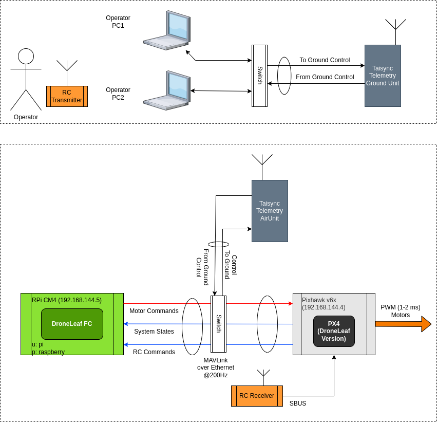
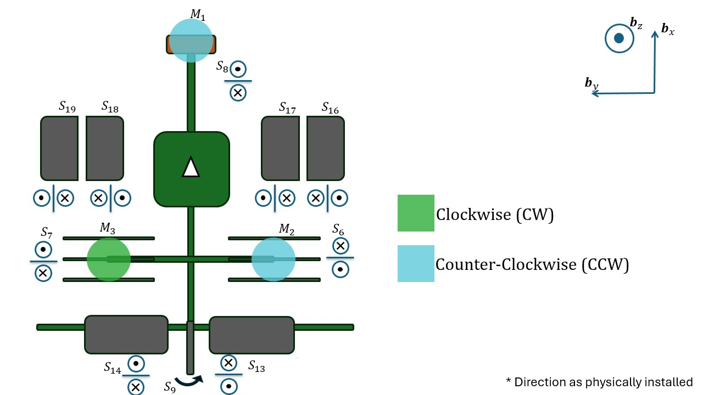
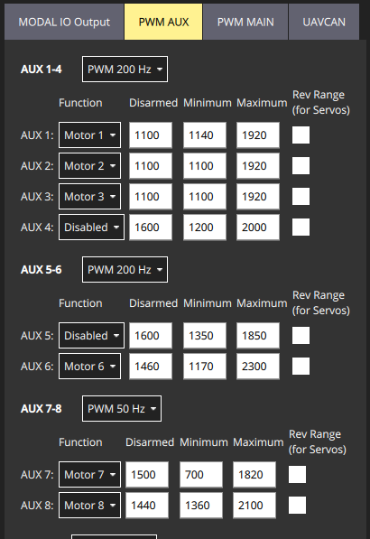
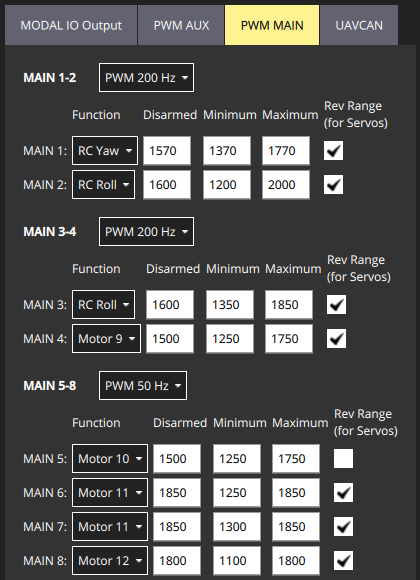

# System Overview

@import "[TOC]" {cmd="toc" depthFrom=1 depthTo=6 orderedList=false}

<!-- code_chunk_output -->

- [System Overview](#system-overview)
  - [Architecture](#architecture)
  - [Convention](#convention)
  - [PX4 Settings](#px4-settings)
    - [Custom PX4 Firmware and Parameters](#custom-px4-firmware-and-parameters)
    - [Physical Asset assignment](#physical-asset-assignment)
    - [Actuation PX4 settings](#actuation-px4-settings)
  - [RC Settings](#rc-settings)
    - [RC Channel assignment](#rc-channel-assignment)
    - [RC Switches Settings](#rc-switches-settings)
  - [Surfaces and Servos calibration](#surfaces-and-servos-calibration)
    - [Calibration values](#calibration-values)
  - [Other Components](#other-components)
    - [Airspeed sensor](#airspeed-sensor)
  - [Flight Operation | Software Aspects](#flight-operation--software-aspects)
- [LeafFC](#leaffc)
  - [DOT Graphs](#dot-graphs)
  - [Topics Inspection](#topics-inspection)
  - [Configuration files](#configuration-files)
  - [MATLAB based auto-configuration](#matlab-based-auto-configuration)
  - [Major Subsystems' Settings](#major-subsystems-settings)
    - [PX4 RC to Orientation and Throttle mapping](#px4-rc-to-orientation-and-throttle-mapping)
    - [State Estimator](#state-estimator)
    - [Control System](#control-system)
    - [VTOL Actuation System](#vtol-actuation-system)
      - [Allocation logic](#allocation-logic)
      - [Prioritized allocation](#prioritized-allocation)
      - [Doors Control](#doors-control)
      - [Compensation Factors](#compensation-factors)
        - [Front tilt servo compensation](#front-tilt-servo-compensation)
      - [Post Allocation Bias](#post-allocation-bias)
      - [Trimming the input independent of RC](#trimming-the-input-independent-of-rc)
      - [Motor mapping from LeafFC to PX4](#motor-mapping-from-leaffc-to-px4)
    - [Angles Observer](#angles-observer)

<!-- /code_chunk_output -->


## Architecture

The general system archeticture is given as follows:



## Convention
This convention is what to expect when moving knobs in QGroundControl after performing all PX4 settings mentioned below.




## PX4 Settings
### Custom PX4 Firmware and Parameters
Request the latest PX4 firmware from DroneLeaf. Once uploaded through QGC, you need to set the `SYS_AUTOSTART` parameter to `4999`.

### Physical Asset assignment
| **Reference** | **Function**  | **Pixhawk Pin** | **Signal Source**  |
|---------------|---------------|-----------------|--------------------|
| **M1**        | Front Motor   | AUX 1           | OFFBOARD MAVLink 1 |
| **M2**        | Rear Motor R  | AUX 2           | OFFBOARD MAVLink 2 |
| **M3**        | Rear Motor L  | AUX 3           | OFFBOARD MAVLink 3 |
| **S4**        | Canard        | AUX 4           | OFFBOARD MAVLink 4 |
| **S5**        | --------      | AUX 5           | OFFBOARD MAVLink 5 |
| **S6**        | Vane R        | AUX 6           | OFFBOARD MAVLink 6 |
| **S7**        | Vane L        | AUX 7           | OFFBOARD MAVLink 7 |
| **S8**        | M1 Tilt Servo | AUX 8           | OFFBOARD MAVLink 8 |
| **S9**        | Rudder        | MAIN 1          | RC Yaw             |
| **S10**       | --------      | MAIN 1          | RC Yaw             |
| **S11**       | Aileron R      | MAIN 2          | RC ROLL            |
| **S12**       | Aileron L      | MAIN 3          | RC ROLL            |
| **S13**       | Elevator R    | MAIN 4          | OFFBOARD MAVLink 9 |
| **S14**       | Elevator L    | MAIN 5          | OFFBOARD MAVLink 10|
| **S15**       | Steering      | RC Direct       | RC AUX 1           |
| **S16**       | Door R/R      | MAIN 8          | OFFBOARD MAVLink 12|
| **S17**       | Door R/L      | MAIN 6          | OFFBOARD MAVLink 11|
| **S18**       | Door L/R      | MAIN 7          | OFFBOARD MAVLink 11|
| **S19**       | Door L/L      | MAIN 8          | OFFBOARD MAVLink 12|


### Actuation PX4 settings
Maximum/Minimum limits for each actuator are set in the QGC. See QGC screenshots below.



## RC Settings
Used Controller is Futaba T18SG. ID: T18SG-01.
### RC Channel assignment
See `Systems/RC/general.json` for updated HEAR configuration.

| **RC Channel** | **PX4 Assignment** | **Used in HEAR FC** | **Futaba T18SG Assignment** |
|----------------|--------------------|---------------------|-----------------------------|
| **CH1**        | RC ROLL            | Yes                 | J1                          |
| **CH2**        | RC PITCH           | Yes                 | J2                          |
| **CH3**        | RC THROTTLE        | Yes                 | J3                          |
| **CH4**        | RC YAW             | Yes                 | J4                          |
| **CH5**        |                    |                     |                             |
| **CH6**        |                    | Yes (CH_number_for_forward_motion)   | RS                          |
| **CH7**        |                    |                     |                             |
| **CH8**        | RC AUX 2           | Yes (CH_number_for_switch_vtol_mode)                | SA                          |
| **CH9**        |                    |                     |                             |
| **CH10**       | RC AUX 1           |                     | LD                          |
| **CH11**       | Kill switch        |                     | SF                          |
| **CH12**       |                    |                     |                             |

### RC Switches Settings
| RC Switch/Knob 	| Max Val 	| Min Val 	| Max Val Pos 	| Min Val Pos 	|
|----------------	|---------	|---------	|-------------	|-------------	|
| CH1            	| +100    	| -100    	| West        	| East        	|
| CH2            	| +100    	| -100    	| North       	| South       	|
| CH3            	| +100    	| -100    	| North       	| South       	|
| CH4            	| +100    	| -100    	| West        	| East        	|
| CH6            	| +100    	| -100    	| South       	| North       	|
| CH8            	| +140    	| 0       	| South       	| Middle      	|
| CH10           	| +100    	| -100    	| East        	| West        	|
| CH11           	| +100    	| -100    	| South       	| North       	|

* Top of the RC points north

## Surfaces and Servos calibration
### Calibration values

| Actuator 	| Positive Set Angle Limit 	| Negative Set Angle Limit 	| Positive Mechanical Limit 	| Negative Mechanical Limit 	| PWM at the Positive Set Angle 	| PWM at the Negative Set Angle 	| PWM at the Positive Mechanical Limit 	| PWM at the Negative Mechanical Limit 	| Zero Angle Reference wrt datum 	|
|----------	|--------------------------	|--------------------------	|---------------------------	|---------------------------	|-------------------------------	|-------------------------------	|--------------------------------------	|--------------------------------------	|--------------------------------	|
| S4       	| 15                       	| 15                       	|                           	|                           	|                               	|                               	|                                      	|                                      	|                                	|
| S6       	| 40                       	| 40                       	|                           	|                           	|                               	|                               	|                                      	|                                      	|                                	|
| S7       	| 40                       	| 40                       	|                           	|                           	|                               	|                               	|                                      	|                                      	|                                	|
| S8       	| 10                        	| 70                       	|                           	|                          	|                               	|                               	|                                      	|                                      	|                                	|
| S9       	| 45                        	| 45                       	|                           	|                          	|                               	|                               	|                                      	|                                      	|                                	|
| S13      	| 40                       	| 40                       	|                           	|                           	|                               	|                               	|                                      	|                                      	|                                	|
| S14      	| 40                       	| 40                       	|                           	|                           	|                               	|                               	|                                      	|                                      	|                                	|
* For PWM limits corresponding to the physical angle limits, refer to the PX4 actuator settings panes above.
* All angles are in degrees.


## Other Components
### Airspeed sensor
Using CUAV SKYE2 airspeed sensor.

(Already integrated in the PX4 KU Snono autostart script)
airspeed_selector start


calibration:
ASPD_SCALE_1
SENS_DPRES_OFF

## Flight Operation | Software Aspects
**Recommended**: Use `Yakuake` as a quick call CLI terminal.
From the Operator PC ssh into the companion computer
```bash
ssh pi@192.168.144.5
# password: raspberry
```
after login, run the flight controller (it is the master node in this ROS setup):
```bash
roslaunch flight_controller px4_rc_vtol_control.launch
```

if you want to record ROS topics generated by the FC use:
```bash
rosbag record -a
```
**Warning**: ensure the free disk space is 2GB at least to avoid OS hangup.

Once the flight controller is running, in the Operator PC you need to run the mission controller:
```bash
roslaunch mission_control rc_ori_yaw_rate.launch
```

And then type `s` to load the configurations from the Operator PC to the flight controller, followed by `i` to idle and then `a` to arm the aircraft.


**Note:** Keep the QGC running for monitoring of the mission and to access the logs.

# LeafFC
## DOT Graphs
The DOT graphs for each of the flight systems are in the `DotGraphs` folder.

There are two graphs characterizing each system in LeafFC:
1- Sync Graph: These are synchronous connections that computes every 5 milliseconds (sampling period).
2- Async Graph: These are asynchronous connections that get called only when needed, e.g. transition event.

An online DOT graph viewer can be used to view these graphs. A viewer we recommend is [Edotor](https://edotor.net/).

## Topics Inspection
From the DOT graphs, follow the subsystems and look for ROS publisher blocks (have left facing arrow shapes) and listen to them in the CLI. Use `rostopic echo /xyz` where `/xyz` is the topic name.

For array ROS types, it is possible to output a specific array index, e.g. `rostopic echo /KU_TriCopter_vtol_manual_control_01/px4_rc_to_ori_thrust/rc_raw/data[0]` to output the first array element.

## Configuration files
LeafFC reads the configuration files at LeafFC boot-up. Hence LeafFC needs to be restarted to apply settings updates.

The configuration files are all located in `HEAR_Configurations` folder in the `home` directory of the Raspberry Pi.

The configurations files relevant to KU Snono VTOL are located in the following files:
1. **RC Settings**: `HEAR_Configurations/UAV_types/TriCopterKU_vtol_manual_control/px4_rc_to_ori_thrust/general.json`
2. **VTOL/Fixed-wing Specific Settings**: `HEAR_Configurations/Systems/VTOL/general.json` and `general.json` files in the directory sub-folders.
3. **Snono UAV Type Specific Settings**: `HEAR_Configurations/UAV_types/TriCopterKU_vtol_manual_control/general.json`.
4. **Actuation Allocation Settings**: `HEAR_Configurations/Allocation_types/general.json`.
5. **Actuation Post Allocation Bias Settings**: `HEAR_Configurations/Allocation_types/PostAllocationMotorBias/general.json`

**Note**: Items `3-5` above are based on MATLAB auto-configurations scripts.

## MATLAB based auto-configuration
Once the aircraft mechanical trimming and angle measurements has been taken, you could follow these steps to get configuration files updated with the correct allocation and trimming values.
1. Update the input files:
a. `set_PWM_ranges.m`
b. The design script in `/Motors_Allocation/designs` (create a new `.m` file for every design).
c. Change in `main.m` the variable `design_name` to the correct design.

2. Run `main.m`.

3. Copy the generated files to the Raspberry PI and replace the existing ones:
a. `ToConfigurations/general.json` to `HEAR_Configurations/UAV_types/TriCopterKU_vtol_manual_control/general.json` on RPi.
b. `ToConfigurations/Allocation_types/general.json` to `HEAR_Configurations/Allocation_types//general.json` on RPi.
c. `ToConfigurations/Allocation_types/PostAllocationMotorBias/general.json` to `HEAR_Configurations/Allocation_types/PostAllocationMotorBias/general.json` on RPi.

## Major Subsystems' Settings
### PX4 RC to Orientation and Throttle mapping
The RC maps are stored in `HEAR_Configurations/UAV_types/TriCopterKU_vtol_manual_control/px4_rc_to_ori_thrust/general.json`.

For example:
1. Roll/Pitch: modify `map_for_roll` and `map_for_pitch` to map from the RC input range to the desired control angle in radians.
2. Yaw rate: modify `map_for_yaw_rate` from the RC input range to the desired control rate angle in radians per second.
3. Forward slider: modify `map_for_fwd`.
4. Select the mapped RC channel from `CH_number_for_x` if needed.

### State Estimator
Relays PX4 orientation and orientation rate estimates. See the system DOT graph for available topics

### Control System
You can configure the PID parameters. For the current version it is only permissible to change `kp` and `kd` which can be changed in  `HEAR_Configurations/UAV_types/TriCopterKU_vtol_manual_control/px4_rc_to_ori_thrust/PID/` folder.
1. Pitch controller: change `kp` and `kd` in `pitch.json`.
2. Roll controller: change `kp` and `kd` in `roll.json`.
3. Yaw Rate controller: change `kp` in `yawrate.json`.

**Important**: The controller gains are loaded from the mission control PC `HEAR_Configurations`, NOT the RPi `HEAR_Configurations`.

### VTOL Actuation System
The actuation system has been specifically designed for the Snono VTOL. The actuation system functionalities are detailed below.

#### Allocation logic
The allocation is performed at two modes:

**VTOL**:
1. `TriCopterKU_vtol_manual_control_gain_positive`: Applies in the VTOL mode when the input to the allocation matrix is positive.
2. `TriCopterKU_vtol_manual_control_gain_negative`: Applies in the VTOL mode when the input to the allocation matrix is negative.

**Fixed Wing**:
1. `TriCopterKU_vtol_manual_control_plane_gain_positive`: Applies in the fixed-wing mode when the input to the allocation matrix is positive.
2. `TriCopterKU_vtol_manual_control_plane_gain_negative`: Applies in the fixed-wing mode when the input to the allocation matrix is negative.

The allocation is performed by multiplying the vector consisting of:
[
    Roll,
    Pitch,
    Yaw,
    Throttle,
    Forward,
    Roll Feedforward,
    Pitch Feedforward,
    Yaw Feedforward
]

by the allocation matrix (Outputs x Inputs), in our case (10 x 8) and the outputs are the motor inputs sent to PX4. Note that in our case we send 12 motor commands to PX4 with 10 comming from allocation and 2 additional for the doors making a total of 12. This is since the doors actuators are not involved in allocation.

The Feedforward signals are not passed by the feedback system.

**Example**
Let us take for example a throttle value of 0.5 with the following positive VTOL matrix:
[ 
  [
    0,
    -0.7071,
    0,
    0.45260087506076807,
    0,
    0,
    0,
    0
  ],
  [
    -0.7071,
    0.63266842105263144,
    0,
    1,
    0,
    0,
    0,
    0
  ],
  [
    0.7071,
    0.63266842105263144,
    0,
    1,
    0,
    0,
    0,
    0
  ],
  [
    0,
    0,
    0,
    0,
    0,
    0,
    0,
    0
  ],
  [
    0,
    0,
    0,
    0,
    0,
    0,
    0,
    0
  ],
  [
    0,
    0,
    0.31944444444444442,
    0,
    0.11979166666666674,
    0,
    0,
    0
  ],
  [
    0,
    0,
    0.31944444444444442,
    0,
    -0.12013888888888889,
    0,
    0,
    0
  ],
  [
    0,
    0,
    0,
    0,
    0.65116279069767469,
    0,
    0,
    0
  ],
  [
    0,
    0,
    0,
    0,
    0,
    -0.489010989010989,
    0.510989010989011,
    0
  ],
  [
    0,
    0,
    0,
    0,
    0,
    0.50609756097560976,
    0.50609756097560976,
    0
  ]
]

**Then:** 
M1 would receive a command of 0.5 x 0.4526= 0.2263 due to throttle command.
M2 would receive 1 x 0.4526= 0.4526 due to throttle command.
M3 would receive 1 x 0.4526= 0.4526 due to throttle command.

S4-S10 would receive zero.


#### Prioritized allocation
In VTOL mode, prioritized allocation applies for yaw and forward inputs leading to vanes output. With prioritized allocation yaw overrides forward action when vanes reach saturation.

#### Doors Control
The doors closing sequence is characterized by the parameters in `HEAR_Configurations/Systems/VTOL/general.json`. Door parameters are described here:
1. `DELAY_DOORS_OPENING_CLOSING_SEQ`: Delay of outer doors closing following inner doors closing in seconds.
2. `DOORS_PAIR_OPENING_DURATION`: Duration of opening/closing movement of doors in seconds.
3. `DELAY_VANES_CLOSING_VTOL_TO_PLANE`: Not in effect.
4. `SET_DELAY_M2_M3_SPINUP_VTOL_TO_PLANE`: Sets the delay of M2 and M3 spin-up when transitioning from fixed-wing to VTOL, in seconds. This was introduced to avoid accidental suction of doors by the motors.

#### Compensation Factors
The compensation against thrust loss due to tilting of motors and control surfaces is detailed in `Scheduling of thrusters against thrust loss` document.

There are three compensation terms in effect.
##### Front tilt servo compensation
The tilt compensation of the front tilt servo is controlled by the `minimum_angle_deg_vtol` and `maximum_angle_deg_vtol` parameters in the `HEAR_Configurations/UAV_types/TriCopterKU_vtol_manual_control/general.json` configuration file.

But the compensation does kick-in only after the dead-band parameter `FRT_TILT_SERVO_DEADBAND_NORMALIZED` in `HEAR_Configurations/Systems/VTOL/general.json`.

**Example**
Let the `maximum_angle_deg_vtol` of the front tilt servo be set to `60 deg` and `FRT_TILT_SERVO_DEADBAND_NORMALIZED` be `0.75`. Then at a tilt of `0.75x60=45 deg` we have a compensation multiplier of `1` (i.e. no compensation). But at a tilt of `60 deg` we got a compensation multiplier of `1/cos(60)=2`.


#### Post Allocation Bias
Allocation is a homogeneous transformation in its essence (i.e. has scaling properties). However, in some cases it is required to have a bias post allocation gains. 

Post allocation bias can be configured from `HEAR_Configurations/Allocation_types/PostAllocationMotorBias/general.json`.

#### Trimming the input independent of RC
Transitioning from VTOL to fixed-wing poses additional challenges not solvable by off-the-shelf configurable hardware. For example, RC units allow trimming but we would have two sets of trims: one for VTOL and the other one for fixed-wing. The pilot cannot switch between two set of trims mid-flight.

LeafFC allows custom trimming and Feedforward gains for VTOL and fixed-wing modes independently allowing trimming of the pilot input. These trims can be configured from the `HEAR_Configurations/Systems/VTOL/*` folder and its sub-folders. The correspondence between the configurations parameters and the system blocks can be found by inspecting the root system DOT graph.

#### Motor mapping from LeafFC to PX4
By definition, the PX4 receives a MAVLink message of the 12 offboard motor commands (`Motor x` in QGC). The LeafFC sends these commands in the range of `0-1` and PX4 translates them to the minimum and maximum PWM range.

The 12 LeafFC motor commands sent to PX4 can be inspected by the ROS topic `/KU_TriCopter_vtol_manual_control_01/actu_sys/to_px4_cmds`.

**Example**
Let LeafFC send `0.3` command to M1. Let M1 minimum PWM setting be `1100` and maximum PWM setting be `1900`. Then the PWM command sent to the ESC would be `(1900-1100)x0.3+1100=1340`.


### Angles Observer
LeafFC has an angle observer based on mechanical calibration inputs. The observer works based on servo output commands, and hence its ROS topics are under the `actu_sys` path.

**Note**: Front tilt servo observer is used to provide compensation.