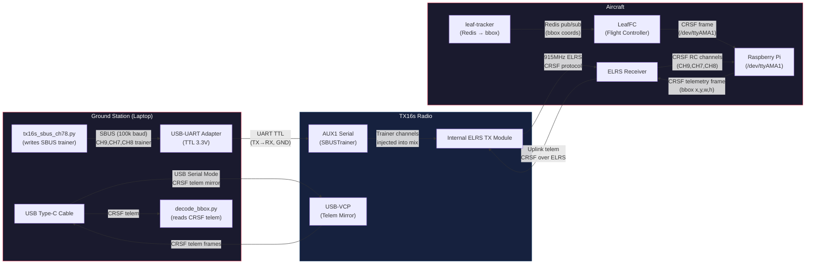
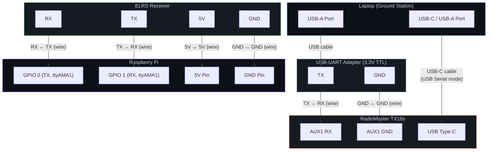

# Ground Station ↔ Aircraft CRSF Telemetry Architecture

Bidirectional bounding-box telemetry between a ground station laptop (via TX16s) and a Raspberry Pi companion computer (via ELRS receiver), using the CRSF protocol over ExpressLRS.

---

## Table of Contents

- [System Architecture](#system-architecture)
- [Electrical Wiring](#electrical-wiring)
- [TX16s Configuration](#tx16s-configuration)
- [Protocol Reference](#protocol-reference)
- [LeafFC C++ Pseudocode](#leaffc-c-pseudocode-crsf-telemetry-transmit)
- [Scripts](#scripts)
- [How to Run](#how-to-run)

---

## System Architecture



### Data Flow Summary

| Path | Direction | Protocol | Transport | Data |
|------|-----------|----------|-----------|------|
| Laptop → TX16s AUX1 | GS → Radio | SBUS | UART TTL 100 kbaud | Trainer CH9, CH7, CH8 |
| TX16s → ELRS RX | Radio → Aircraft | CRSF | 915 MHz ELRS | RC channels (incl. trainer) |
| ELRS RX → RPi | Aircraft internal | CRSF | UART 420 kbaud | RC channel data |
| LeafFC → RPi UART | Aircraft internal | CRSF | UART 420 kbaud | Bbox telemetry frame |
| RPi → ELRS RX → TX16s | Aircraft → GS | CRSF | UART → ELRS → USB | Bbox telemetry frame |
| TX16s USB-VCP → Laptop | Radio → GS | CRSF | USB Serial (telem mirror) | Bbox telemetry frame |

---

## Electrical Wiring



### Ground Station Wiring

| From | To | Wire |
|------|----|------|
| USB-UART Adapter **TX** | TX16s AUX1 **RX** | Signal wire |
| USB-UART Adapter **GND** | TX16s AUX1 **GND** | Ground wire |
| Laptop USB port | TX16s **USB Type-C** | USB cable (set USB mode to **USB Serial**) |

### Aircraft Wiring

| From | To | Wire |
|------|----|------|
| ELRS RX **TX** | RPi **RX** (GPIO 1 / ttyAMA1) | Signal wire |
| ELRS RX **RX** | RPi **TX** (GPIO 0 / ttyAMA1) | Signal wire |
| ELRS RX **5V** | RPi **5V** pin | Power wire |
| ELRS RX **GND** | RPi **GND** pin | Ground wire |

> **Note:** The ELRS receiver UART runs at **420000 baud** (CRSF standard). Ensure `/dev/ttyAMA1` is freed from the Linux console (disable `serial-getty` on that port).

---

## TX16s Configuration

*(EdgeTX firmware 2.12.0)*

### Hardware Setup

Under `SYS` open the **ExpressLRS** Lua script and set:

```
ELRS Packet rate : 333 Hz Full (-105 dBm)
Telemetry Ratio  : 1:2
```

Under `HARDWARE` → *Serial Port*:

| Port | Function | Port Power |
|------|----------|------------|
| `AUX1` | `SBUSTrainer` | Off |
| `USB-VCP` | `Telem Mirror` | — |

### Model Setup

1. Under `MDL` → *Model Settings* → **Trainer** → set to `Master/Serial`.
2. Under *Mixes*, configure channels to source from trainer inputs:

| Channel | Source | Weight |
|---------|--------|--------|
| CH9 | TR9 | 100% |
| CH7 | TR7 | 100% |
| CH8 | TR8 | 100% |

The TX16s will now:
- **Receive** SBUS trainer data on AUX1 and inject CH9/CH7/CH8 into the ELRS channel mix.
- **Mirror** incoming CRSF telemetry from ELRS to the USB-VCP port for the laptop to read.

---

## Protocol Reference

### CRSF Bbox Telemetry Frame

We reuse the CRSF MAVLink frame type slot (`0xAA`) to carry 4 × `uint16` bounding box coordinates:

```
Byte   Field        Value
─────────────────────────────────
 0     Sync         0xEA
 1     Length        0x0A  (type + 8 payload + crc = 10)
 2     Type          0xAA  (CRSF_FRAMETYPE_MAVLINK)
 3-4   x             uint16 LE   ← bbox centre x
 5-6   y             uint16 LE   ← bbox centre y
 7-8   w             uint16 LE   ← bbox width
 9-10  h             uint16 LE   ← bbox height
 11    CRC8          CRC8/DVB-S2 (poly 0xD5) over bytes 2..10
─────────────────────────────────
Total: 12 bytes on the wire
```

CRC polynomial: **0xD5** (DVB-S2), computed over the type + payload bytes.

---

## LeafFC C++ Pseudocode (CRSF Telemetry Transmit)

```cpp
#include <cstdint>
#include <cstring>

// ── CRSF constants ──────────────────────────────────────────────
constexpr uint8_t  CRSF_SYNC              = 0xEA;
constexpr uint8_t  CRSF_FRAMETYPE_MAVLINK = 0xAA;
constexpr uint32_t CRSF_BAUDRATE          = 420000;

// ── CRC-8 / DVB-S2 (poly 0xD5) ─────────────────────────────────
uint8_t crc8_dvb_s2(const uint8_t* data, size_t len) {
    uint8_t crc = 0;
    for (size_t i = 0; i < len; i++) {
        crc ^= data[i];
        for (int b = 0; b < 8; b++) {
            if (crc & 0x80)
                crc = (crc << 1) ^ 0xD5;
            else
                crc = crc << 1;
        }
    }
    return crc;
}

// ── Build a 12-byte CRSF frame carrying a bounding box ─────────
//    Returns the number of bytes written into `buf` (always 12).
size_t build_crsf_bbox_frame(uint8_t* buf,
                             uint16_t x, uint16_t y,
                             uint16_t w, uint16_t h)
{
    buf[0] = CRSF_SYNC;
    buf[1] = 10;                       // length: type(1) + payload(8) + crc(1)
    buf[2] = CRSF_FRAMETYPE_MAVLINK;   // frame type

    // payload: 4 × uint16 little-endian
    buf[3]  = x & 0xFF;  buf[4]  = x >> 8;
    buf[5]  = y & 0xFF;  buf[6]  = y >> 8;
    buf[7]  = w & 0xFF;  buf[8]  = w >> 8;
    buf[9]  = h & 0xFF;  buf[10] = h >> 8;

    buf[11] = crc8_dvb_s2(&buf[2], 9); // CRC over type + payload
    return 12;
}

// ── Example: LeafFC main loop ───────────────────────────────────
//
//    bbox coordinates arrive via Redis from the leaf-tracker service.
//    LeafFC reads them and transmits a CRSF telemetry frame to the
//    ELRS receiver over UART (/dev/ttyAMA1).

void leaffc_telemetry_loop(HardwareSerial& uart,
                           RedisClient&    redis)
{
    uart.begin(CRSF_BAUDRATE);

    while (true) {
        // 1. Read latest bbox from Redis pub/sub
        BBox bbox = redis.get_latest("leaf-tracker/bbox");
        //    bbox.x, bbox.y, bbox.w, bbox.h  (uint16 each)

        // 2. Build the CRSF frame
        uint8_t frame[12];
        build_crsf_bbox_frame(frame, bbox.x, bbox.y, bbox.w, bbox.h);

        // 3. Transmit over UART to ELRS receiver
        uart.write(frame, 12);

        // 4. Pace to match telemetry ratio (e.g. ~50 Hz)
        delay_ms(20);
    }
}
```

> **Note:** This is pseudocode for illustration. In a real implementation `HardwareSerial` and `RedisClient` would be replaced with your platform's serial and Redis APIs. The CRSF wire format and CRC are exact.

---

## Scripts

| Script | Side | Purpose |
|--------|------|---------|
| `send_bbox.py` | Aircraft (test) | Send a fixed bbox over CRSF |
| `decode_bbox.py` | Ground station | Decode bbox from CRSF telem mirror |
| `send_bbox_sine.py` | Aircraft (test) | Send sinusoidal bbox with embedded timestamp for latency measurement |
| `decode_bbox_sine.py` | Ground station | Decode sinusoidal bbox and report per-frame latency (min/avg/max) |
| `tx16s_sbus_ch78.py` | Ground station | Send SBUS trainer frames (CH7 sweep, CH8 toggle) to TX16s AUX1 |

---

## How to Run

### Static Bbox Test

```bash
# Aircraft side (or test with loopback)
python3 send_bbox.py --port /dev/ttyUSB0 --baud 416666 --rate 10 \
    --x 320 --y 180 --w 64 --h 48

# Ground station (telem mirror)
python3 decode_bbox.py --port /dev/ttyACM0
```

### Latency Test (Sinusoidal)

```bash
# Aircraft side
python3 send_bbox_sine.py --port /dev/ttyUSB0 --rate 50 --freq 1.0

# Ground station
python3 decode_bbox_sine.py --port /dev/ttyACM0
```

Press `Ctrl-C` on the decoder to print a latency summary (min / avg / max ms).

### SBUS Trainer Injection

```bash
python3 tx16s_sbus_ch78.py /dev/ttyUSB1
```

