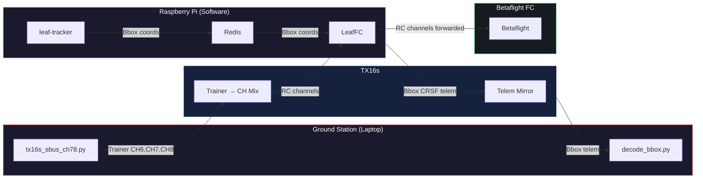
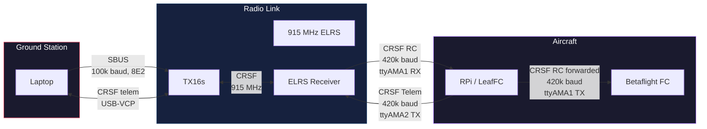
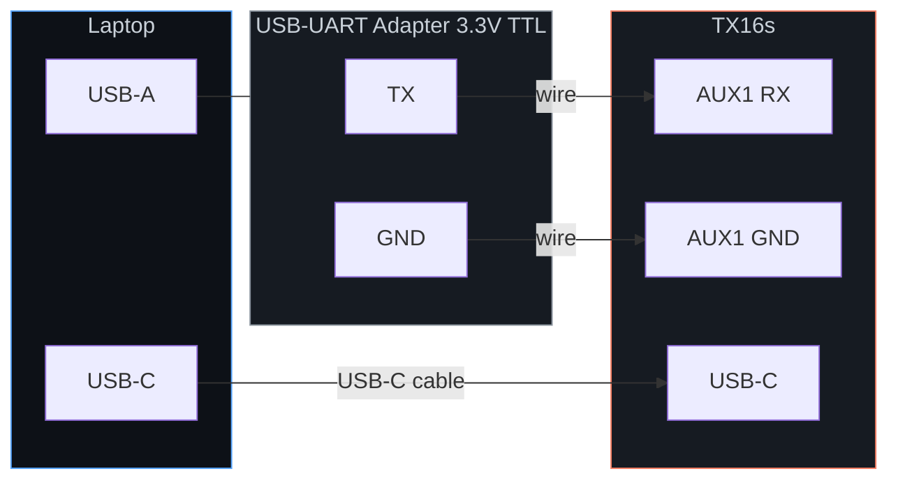
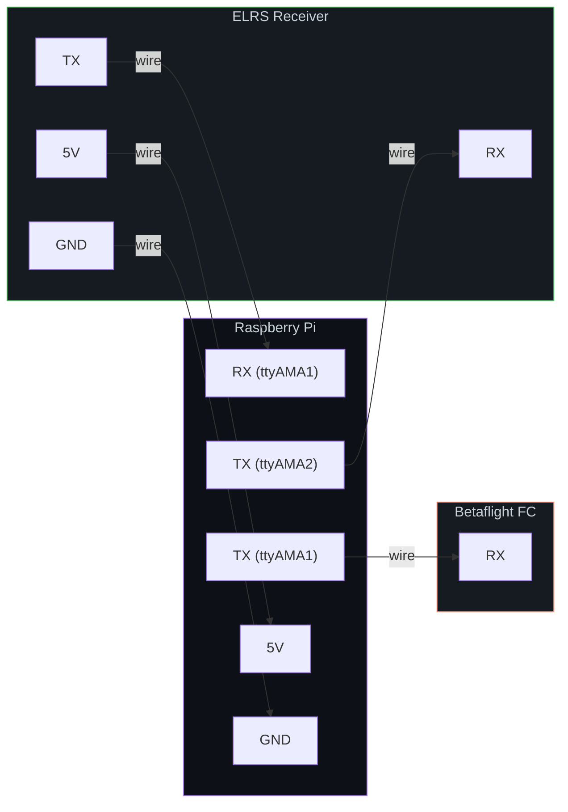

# Ground Station ↔ Aircraft CRSF Telemetry Architecture

Bidirectional bounding-box telemetry between a ground station laptop (via TX16s) and a Raspberry Pi companion computer (via ELRS receiver), using the CRSF protocol over ExpressLRS.

---

## Table of Contents

- [Application Layer](#application-layer)
- [Communication Layer](#communication-layer)
- [Hardware / Electrical Layer](#hardware--electrical-layer)
- [TX16s Configuration](#tx16s-configuration)
- [Protocol Reference](#protocol-reference)
- [LeafFC C++ Pseudocode](#leaffc-c-pseudocode-crsf-telemetry-transmit)
- [Scripts](#scripts)
- [How to Run](#how-to-run)

---

## Application Layer

Software components and their data relationships.



| Component | Runs On | Role |
|-----------|---------|------|
| `tx16s_sbus_ch78.py` | Laptop | Sends SBUS trainer frames (CH6/CH7/CH8) to TX16s |
| `decode_bbox.py` | Laptop | Reads bbox telemetry from TX16s telem mirror |
| TX16s Trainer Mix | TX16s | Injects trainer channels into ELRS RC channel mix |
| TX16s Telem Mirror | TX16s | Outputs received CRSF telemetry to laptop via USB-VCP |
| **LeafFC** | RPi | Receives CRSF RC from ELRS RX, forwards to Betaflight FC; reads bbox from Redis, sends CRSF telem back to ELRS RX |
| **leaf-tracker** | RPi | Vision pipeline that publishes bbox coordinates to Redis |
| **Betaflight** | Flight Controller | Receives forwarded RC channels from LeafFC |

---

## Communication Layer

Protocols used on each link.



| Link | Protocol | Baud / Frequency | Direction | Data |
|------|----------|------------------|-----------|------|
| Laptop → TX16s AUX1 | SBUS | 100 kbaud (8E2) | GS → Radio | Trainer CH6, CH7, CH8 |
| TX16s USB-VCP → Laptop | CRSF | USB | Radio → GS | Bbox telemetry |
| TX16s ↔ ELRS RX | CRSF over ELRS | 915 MHz | Bidirectional | RC downlink + telem uplink |
| ELRS RX TX → RPi RX (`ttyAMA1`) | CRSF | 420000 baud | RX → RPi | RC channel data |
| RPi TX (`ttyAMA1`) → Betaflight RX | CRSF | 420000 baud | RPi → FC | RC channels (forwarded) |
| RPi TX (`ttyAMA2`) → ELRS RX RX | CRSF | 420000 baud | RPi → RX | Bbox telemetry frame |
| leaf-tracker → LeafFC | Redis pub/sub | localhost | Internal | Bbox coordinates |

---

## Hardware / Electrical Layer

Physical wiring between components.

### Ground Station Wiring



| From | To | Wire |
|------|----|------|
| USB-UART Adapter **TX** | TX16s AUX1 **RX** | Signal wire |
| USB-UART Adapter **GND** | TX16s AUX1 **GND** | Ground wire |
| Laptop **USB-C** | TX16s **USB-C** | USB cable (TX16s USB mode → **CLI**) |

### Aircraft Wiring

The RPi uses **two** UARTs to the ELRS receiver and one to Betaflight:



| From | To | Wire | Purpose |
|------|----|------|---------|
| ELRS RX **TX** | RPi **RX** (`ttyAMA1`) | Signal | RC channels → LeafFC |
| RPi **TX** (`ttyAMA1`) | Betaflight **RX** | Signal | LeafFC forwards RC → FC |
| RPi **TX** (`ttyAMA2`) | ELRS RX **RX** | Signal | LeafFC sends bbox telem → ELRS |
| ELRS RX **5V** | RPi **5V** pin | Power | Powers ELRS receiver |
| ELRS RX **GND** | RPi **GND** pin | Ground | Common ground |

> **Note:** Both `/dev/ttyAMA1` and `/dev/ttyAMA2` run at **420000 baud**. Ensure both are freed from the Linux console (`disable serial-getty`).

---

## TX16s Configuration

*(EdgeTX firmware 2.12.0)*

### Hardware Setup

Under `SYS` open the **ExpressLRS** Lua script and set:

```
ELRS Packet rate : 333 Hz Full (-105 dBm)
Telemetry Ratio  : 1:2
```

Under `HARDWARE` → *Serial Port*:

| Port | Function | Port Power |
|------|----------|------------|
| `AUX1` | `SBUSTrainer` | Off |
| `USB-VCP` | `Telem Mirror` | — |

### Model Setup

1. Under `MDL` → *Model Settings* → **Trainer** → set to `Master/Serial`.
2. Under *Mixes*, configure channels to source from trainer inputs:

| Channel | Source | Weight |
|---------|--------|--------|
| CH7 | TR7 | 100% |
| CH8 | TR8 | 100% |
| CH9 | TR9 | 100% |

The TX16s will now:
- **Receive** SBUS trainer data on AUX1 and inject CH6/CH7/CH8 into the ELRS channel mix.
- **Mirror** incoming CRSF telemetry from ELRS to the USB-VCP port for the laptop to read.

---

## Protocol Reference

### CRSF Bbox Telemetry Frame

We reuse the CRSF MAVLink frame type slot (`0xAA`) to carry 4 × `uint16` bounding box coordinates:

```
Byte   Field        Value
─────────────────────────────────
 0     Sync         0xEA
 1     Length        0x0A  (type + 8 payload + crc = 10)
 2     Type          0xAA  (CRSF_FRAMETYPE_MAVLINK)
 3-4   x             uint16 LE   ← bbox centre x
 5-6   y             uint16 LE   ← bbox centre y
 7-8   w             uint16 LE   ← bbox width
 9-10  h             uint16 LE   ← bbox height
 11    CRC8          CRC8/DVB-S2 (poly 0xD5) over bytes 2..10
─────────────────────────────────
Total: 12 bytes on the wire
```

CRC polynomial: **0xD5** (DVB-S2), computed over the type + payload bytes.

---

## LeafFC C++ Pseudocode (CRSF Telemetry Transmit)

LeafFC runs on the Raspberry Pi. It reads RC channels from the ELRS receiver on `/dev/ttyAMA1` (RX), forwards them to Betaflight on `/dev/ttyAMA1` (TX), and sends bbox CRSF telemetry back to the ELRS receiver on `/dev/ttyAMA2` (TX).

```cpp
#include <cstdint>
#include <cstring>

// ── CRSF constants ──────────────────────────────────────────────
constexpr uint8_t  CRSF_SYNC              = 0xEA;
constexpr uint8_t  CRSF_FRAMETYPE_MAVLINK = 0xAA;
constexpr uint32_t CRSF_BAUDRATE          = 420000;

// ── CRC-8 / DVB-S2 (poly 0xD5) ─────────────────────────────────
uint8_t crc8_dvb_s2(const uint8_t* data, size_t len) {
    uint8_t crc = 0;
    for (size_t i = 0; i < len; i++) {
        crc ^= data[i];
        for (int b = 0; b < 8; b++) {
            if (crc & 0x80)
                crc = (crc << 1) ^ 0xD5;
            else
                crc = crc << 1;
        }
    }
    return crc;
}

// ── Build a 12-byte CRSF frame carrying a bounding box ─────────
size_t build_crsf_bbox_frame(uint8_t* buf,
                             uint16_t x, uint16_t y,
                             uint16_t w, uint16_t h)
{
    buf[0] = CRSF_SYNC;
    buf[1] = 10;                       // length: type(1) + payload(8) + crc(1)
    buf[2] = CRSF_FRAMETYPE_MAVLINK;   // frame type

    // payload: 4 × uint16 little-endian
    buf[3]  = x & 0xFF;  buf[4]  = x >> 8;
    buf[5]  = y & 0xFF;  buf[6]  = y >> 8;
    buf[7]  = w & 0xFF;  buf[8]  = w >> 8;
    buf[9]  = h & 0xFF;  buf[10] = h >> 8;

    buf[11] = crc8_dvb_s2(&buf[2], 9); // CRC over type + payload
    return 12;
}

// ── LeafFC main loop (runs on Raspberry Pi) ─────────────────────
//
//    /dev/ttyAMA1 RX  ← ELRS Receiver TX   (RC channels in)
//    /dev/ttyAMA1 TX  → Betaflight FC RX    (RC channels forwarded)
//    /dev/ttyAMA2 TX  → ELRS Receiver RX    (bbox telemetry out)

void leaffc_main(Serial& uart_rc,      // /dev/ttyAMA1
                 Serial& uart_telem,    // /dev/ttyAMA2
                 RedisClient& redis)
{
    uart_rc.open("/dev/ttyAMA1", CRSF_BAUDRATE);
    uart_telem.open("/dev/ttyAMA2", CRSF_BAUDRATE);

    while (true) {
        // 1. Read CRSF RC frame from ELRS receiver (ttyAMA1 RX)
        CrsfFrame rc_frame = uart_rc.read_crsf_frame();

        // 2. Forward RC frame to Betaflight FC (ttyAMA1 TX)
        uart_rc.write(rc_frame.raw, rc_frame.len);

        // 3. Read latest bbox from Redis (published by leaf-tracker)
        BBox bbox = redis.get_latest("leaf-tracker/bbox");

        // 4. Build CRSF telemetry frame
        uint8_t telem[12];
        build_crsf_bbox_frame(telem, bbox.x, bbox.y, bbox.w, bbox.h);

        // 5. Send bbox telem to ELRS receiver (ttyAMA2 TX)
        uart_telem.write(telem, 12);

        // 6. Pace to match telemetry ratio (~50 Hz)
        delay_ms(20);
    }
}
```

> **Note:** This is pseudocode for illustration. `Serial` and `RedisClient` would be replaced with your platform APIs (e.g. Linux `termios` for UART, `hiredis` for Redis). The CRSF wire format and CRC are exact.

---

## Scripts

| Script | Side | Purpose |
|--------|------|---------|
| `send_bbox.py` | Aircraft (test) | Send a fixed bbox over CRSF |
| `decode_bbox.py` | Ground station | Decode bbox from CRSF telem mirror |
| `send_bbox_sine.py` | Aircraft (test) | Send sinusoidal bbox with embedded timestamp for latency measurement |
| `decode_bbox_sine.py` | Ground station | Decode sinusoidal bbox and report per-frame latency (min/avg/max) |
| `tx16s_sbus_ch78.py` | Ground station | Send SBUS trainer frames (CH7 sweep, CH8 toggle) to TX16s AUX1 |

---

## How to Run

### Static Bbox Test

```bash
# Aircraft side (or test with loopback)
python3 send_bbox.py --port /dev/ttyUSB0 --baud 416666 --rate 10 \
    --x 320 --y 180 --w 64 --h 48

# Ground station (telem mirror)
python3 decode_bbox.py --port /dev/ttyACM0
```

### Latency Test (Sinusoidal)

```bash
# Aircraft side
python3 send_bbox_sine.py --port /dev/ttyUSB0 --rate 50 --freq 1.0

# Ground station
python3 decode_bbox_sine.py --port /dev/ttyACM0
```

Press `Ctrl-C` on the decoder to print a latency summary (min / avg / max ms).

### SBUS Trainer Injection

```bash
python3 tx16s_sbus_ch78.py /dev/ttyUSB1
```

