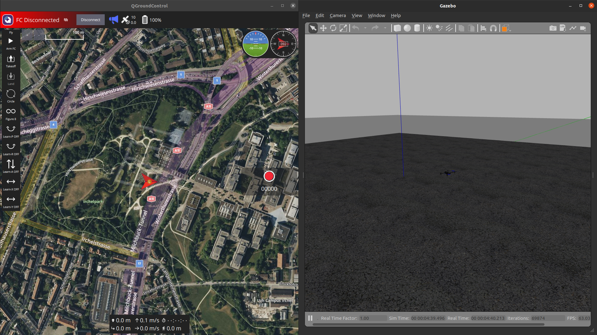
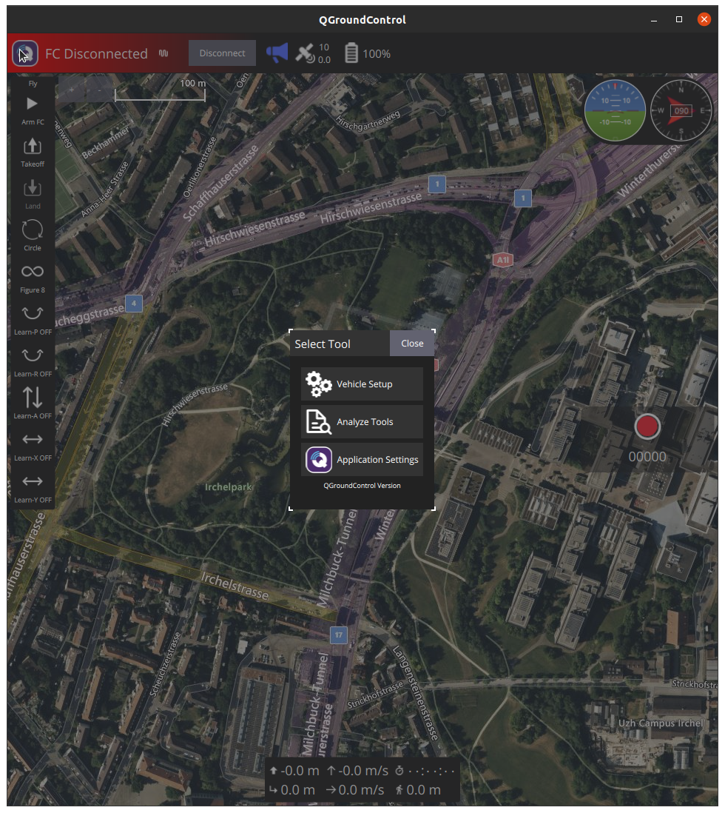
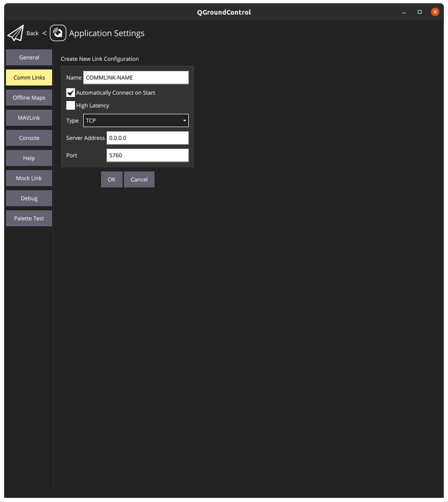
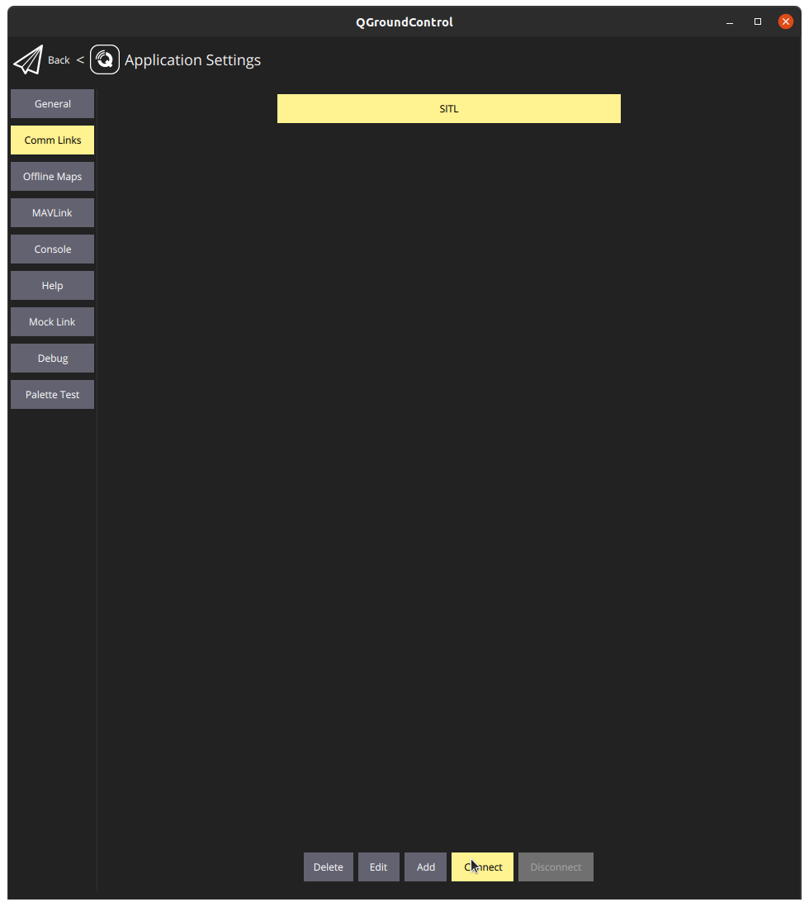

# Overview

This document describes how the SITL is run with PX4 gazebo environment.


## DroneLeaf developers

### Your first SITL run!

As you have your machine ready for development and testing, let's run the SITL setup to play around the software stack.

**One-time setup:** run the `hear-cli` program `configure_software_setup_autostart_sitl`. Logout/login after executing the command.

**One-time setup:** run the `hear-cli` program `data_lifecycle_prepare` to install the local dynamoDB and data server.


#### 1 - Mavlink Router


Verify the Mavlink router is running:
```bash
sudo systemctl status mavlink-router.service
```


#### 2 - PX4-Autopilot

```bash
cd PX4-Autopilot
make px4_sitl gazebo-classic
```
This will launch a gazeboo world that contains a drone instance, along with the px4 firmware running in SITL setup for this drone.

If you want to launch a specific drone instance (e.g. DFL), you can specify it by adding the instance postfix after the environment name as follows

```bash
make px4_sitl gazebo-classic_dfl
```

If you do not see the green colored "Ready for takeoff!" message in the terminal, you can use the following command.
```bash
pxh> ekf2 start
```

#### 3 - Leaf QGroundControl

Download QGC
https://droneleafworkspace.slack.com/files/U080N4HR8HG/F086D7BCQQ7/leafmc.appimage


Run the QGroundControl and connect to the PX4 SITL instance via MAVLink.

```bash
cd ~/Downloads # where you downloaded the QGroundControl AppImage
./LeafMC.AppImage
```
You should see something similar to this:



If you see the message "FC Disconnected" like the screenshot then you can move on and launch the FC. Otherwise, if you see the message "Disconnected", you need to create a comm link from QGC settings to be able to communicate through MAVLink.

Click on the QGC symbol on the top left corner of the window and open up the application settings.


Go to Comm Links tab on the top left menu and click on "Add". Then, fill the settings as follows and create the comm link. You can put anything you want in the place of "COMMLINK-NAME".


After that, you can connect to the comm link instance you have created (TCP://:5760), in this case the comm link name is set to "SITL".


#### 4 - Make sure drone data is synced locally correctly
Make sure you are registered in `fly.droneleaf.io` and you already bound your drone with a license.

Make sure you have synced all data from the cloud locally.

*Note:* this part is not documented yet, unfortunately. Please contact one of the core team members to fix.

#### 5 - HEAR_FC
As you have the PX4 SITL running and connected to QGroundControl, you can now run the HEAR_FC to simulate the drone's flight controller.

- Run
    ```bash
    cd ~/HEAR_FC
    source devel/setup.bash
    roslaunch flight_controller px4_flight_mavlink_opti.launch
    ```
Finally, you should see "PX4 Ready to Fly" message on the QGC and you are good to go!
