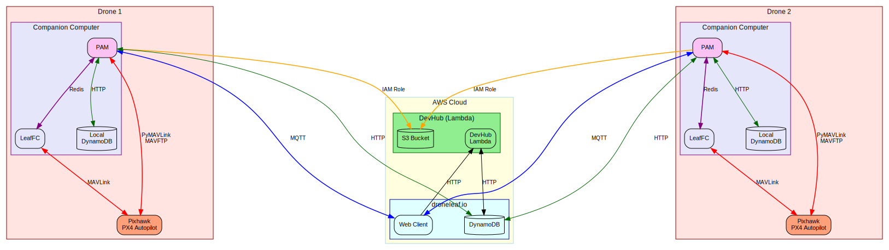

# Getting Started with Petal App Manager

This guide explains at a high level what is the Petal App Manager (PAM) and where to find relevant information to get started with development and deployment.

## Overview

The Petal App Manager is a software component designed to manage and run various Petal applications on edge devices (drones). It provides a framework for integrating different functionalities in the form of "petals", which are modular applications that can be developed and deployed independently.

It also provides a structured way to handle communication with the flight controller using MAVLink protocol, the web client interface via MQTT and dynamoDB, and logging functionalities on DevHub.

The diagram below illustrates the position of the Petal App Manager within the overall droneleaf ecosystem:

## Detailed Documentation

For more detailed information about the Petal App Manager, including its architecture, components, and how to develop and deploy petals, please refer to the following resources:

- [Petal App Manager Sphinx Documentation](https://droneleaf.github.io/petal-app-manager/)
- [Petal App Manager Package on PyPI](https://pypi.org/project/petal-app-manager/)
- [Petal App Manager GitHub Repository](https://github.com/DroneLeaf/petal-app-manager)

## Getting Help
If you have any questions or need assistance with the Petal App Manager, please raise an issue on the [GitHub repository](https://github.com/DroneLeaf/petal-app-manager/issues) or reach out to the DroneLeaf core team.