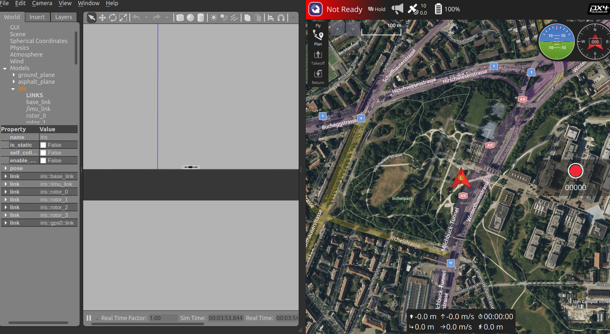
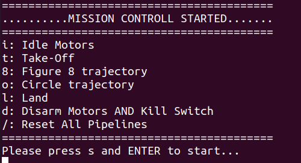

# Overview

This document describes how the SITL is run with PX4 gazebo environment.


## DroneLeaf developers

### Your first SITL run!

As you have your machine ready for development and testing, let's run the SITL setup to play around the software stack.

#### 1 - PX4-Autopilot

```bash
cd PX4-Autopilot
make px4_sitl gazebo-classic
```
This will launch a gazeboo world that contains a drone instance, along with the px4 firmware running in SITL setup for this drone.

If you want to launch a specific drone instance (e.g. DFL), you can specify it by adding the instance postfix after the environment name as follows

```bash
make px4_sitl gazebo-classic_dfl
```

#### 2 - QGroundControl

Run the QGroundControl and connect to the PX4 SITL instance.

```bash
cd ~/Downloads # where you downloaded the QGroundControl AppImage
./QGroundControl.AppImage
```
You should see something similar to this:



**Note:** If you see the message "Ready To Fly" not like the scrrenshot then you are good to go.

To fix "Not Ready" status in the QGroundControl, go to the terminal that you ran the px4_sitl command and run the following command:

```bash
pxh> ekf2 start
```
Then you should see the status "Ready To Fly" in QGroundControl.

#### 3 - HEAR_Configurations
As you have the PX4 SITL running and connected to QGroundControl, you need to setup the configurations before runing the HEAR_FC. There are a couple of settings you have to make sure that setup correctly.

- Systems/Pixhawk
- UAV_instances
- Missions/Scenarios
- Missions/Fleets

Head to ~/HEAR_Configurations/Systems/Pixhawk/ and edit the general.json file to match the following:

```json
{
    "pixhawk_ip": "127.0.0.1",
    "pixhawk_udp_port": 14580,
    "local_ethernet_interface_ip": "127.0.0.1",
    "local_udp_port": 14540,
    "serial_port_addr":"/dev/ttyS0",
    "serial_baud_rate":921600
}
```
You need to set the "pixhawk_ip" and "local_ethernet_interface_ip" to your local IP.

After setting up the Pixhawk configuration, you need to check the general.json file in ~/HEAR_Configurations/UAV_instances/ and edit the "default_uav_instance_name" according to the drone instance that you want to simulate.

```json
{
    "default_uav_instance_name": "DFL_Stork_01",
    "Description": "Define default_uav_instance_name to enforce uav instance name on the current machine"
}
```

Similarly, you should navigate to ~/HEAR_Configurations/Missions/Scenarios and check the configuration of the mission scenario that you aim to run in HEAR_MC. For example, if you want to run demo_fsac.launch in HEAR_MC, you should check the general.json file under FSACdemo/ and see the fleet name.

```json
{
    "Fleet":"FSACdemo",
    "EnumerateFleet":false,
    "fsac_predefined_time_s": 8.0,
    "post_fsac_traj_start_position": [0,0,1.5],
    "post_fsac_traj": "circle_Cinewhoop_Fast",
    "window_target_offset": [0.2, 0, 0]
}
```

Since we know that "demo_fsac" uses "FSACdemo" fleet, we need to configure the general.json file in ~/HEAR_Configurations/Missions/Fleets/FSACdemo and make sure that the "default_uav_instance_name" is in the "UAV_instances" as well.


```json
{
    "UAV_instances":["DFL_Stork_01"]
}
```

Once you go over the each step carefully and configure the settings properly, you are ready to run the HEAR_FC and HEAR_MC.

#### 4 - HEAR_FC
As you have the PX4 SITL running and connected to QGroundControl, you can now run the HEAR_FC to simulate the drone's flight controller.

- Run
    ```bash
    cd ~/HEAR_FC
    source devel/setup.bash
    roslaunch flight_controller px4_flight_mavlink_opti.launch
    ```

#### 5 - HEAR_MC
Now, HEAR_MC provides the CLI interface to perform messions and tasks on the drone. You can run the following command to start the HEAR_MC:

```bash
cd ~/HEAR_MC
source devel/setup.bash
roslaunch mission_control demo_fsac.launch
```
You should see something similar to this:



Yeah!!! Your Good to go, have fun developing and testing with the HEAR software stack.