# DroneLeaf Software Stack

Welcome to DroneLeaf software stack!

This documentation is targeted for developers who wanted to contribute to the DroneLeaf software stack.

It serves as the master documentation and entry point for all things DroneLeaf.

## Anatomy of the software stack

Currently, there are two stages of operation: 
1. **Commissioning**: mainly a process on the web, coordinated with the edge device.
2. **Flight**: the process of flying the drone.

<!-- ToDo: in commissioning stage, does it involve PX4 and leafFC? is there a need for separation? -->
And there are two types of environments:
1. **Deployment**: This is where actual flight happens.
2. **Development**: Happens in two possible ways.
    - **Simulation in the loop (SITL)**: Simulates a real drone visually allowing for safe and convenient testing.
    - **Bench**: Adds a physical pixhawk hardware.

<!-- https://chatgpt.com/share/69142062-1618-8002-8b69-7ab6486b046c -->

The Deployment setup anatomy is given by the following diagram:


The Development SITL setup anatomy is given by the following diagram:


And finally, the Development Bench setup anatomy is given by the following diagram:


# Getting started with Deployment (Targeted for DroneLeaf clients)
To get started with deployment, please refer to the following guide: [DroneLeaf KnowledgeBase](https://droneleaf.github.io/knowledgebase/)

# Getting Started with Development 
Development in the SITL environment involves working with four stacks:

- **Flight stack:** represented by the software-stack repo. [DroneLeaf/software-stack/tree/dev-sitl](https://github.com/DroneLeaf/software-stack/tree/dev-sitl)
- **Petals stack:** a python code base for added value functionality. [DroneLeaf/petal-app-manager](https://github.com/DroneLeaf/petal-app-manager)
- **Controller dashboard:** a gateway application serving as the critical bridge between our cloud services and drone operations [DroneLeaf/Controller_Dashboard](https://github.com/DroneLeaf/Controller-Dashboard)
- **Web client application [fly.droneleaf.io](https://fly.droneleaf.io):** client interface for drone management and monitoring. [DroneLeaf/DroneLeaf_WebClient_With_Amplify](DroneLeaf/DroneLeaf_WebClient_With_Amplify)

## Preparing the Developer Machine
### Prerequisites
- Ubuntu 20.04 LTS
- Hardware: minimum 16GB RAM, 4-core CPU (x86_64/AMD64), 256GB free disk space

### OS Installation
[recommended] Follow the instructions to [set up a
fresh UBUNTU 20.04 on your development machine](./../Hardware%20and%20Process/Development%20Machine%20Preparation/installation_steps_for_Ubuntu_20.04_LTS.md)


### Tools and Packages Installation
You will need to install the following tools and packages to get started with development:

#### Developer tools

- vscode and extensions installation guide: [Guide/External Software/VSCode/README.md](./../External%20Software/VSCode/README.md)
- Yakuake installation and configuration guide: [Guide/External Software/Yakuake/README.md](./../External%20Software/Yakuake/README.md)


#### HEAR-CLI
- Install HEAR_CLI: [Guide/HEAR Software/HEAR_CLI/README.md](./../HEAR%20Software/HEAR_CLI/README.md).

#### Dependency Packages
-   apt packages:

  ```bash
sudo apt install -y build-essential libdbus-glib-1-dev libgirepository1.0-dev \
    git curl wget cmake unzip pkg-config libssl-dev libjpeg-dev libpng-dev \
    libtiff-dev libusb-1.0-0-dev python3-pip jq
  ```
-   python3 packages:

  ```bash
pip3 install --force-reinstall ninja
pip3 install testresources
pip3 install kconfiglib
pip3 install --user jsonschema
pip3 install --user pyros-genmsg
pip3 install --user jinja2
  ```

#### HEAR Software Stack Installation
- Follow HEAR_CLI based installation scripts as per [SITL installation guide](./../HEAR%20Software/Operation/SITL/sitl-installation-on-ubuntu20.04.md)


## Getting Started with Flight Stack Development
Now that you have set up your development machine and installed the HEAR software stack, you can start developing and contributing to the flight stack.


### Cloning
```bash
hear-cli local_machine run_program --p software_stack_clone TODO
# Choose branch: dev-sitl for development, main for latest stable release.
```

### Compilation
The following components can be built from source for development purposes:

#### HEAR_Msgs
```bash
cd ~/software-stack/HEAR_Msgs
# optional: clean build
# rm -rf devel/ build/
catkin_make
source devel/setup.bash
```

#### LeafFC
> In clean build, redo the HEAR_Msgs build step first.
```bash
cd ~/software-stack/HEAR_FC
# optional: clean build
# rm -rf devel/ build/
catkin_make -DCMAKE_BUILD_TYPE=Debug -DHEAR_TARGET=SITL
source devel/setup.bash
# Launching the flight controller 
roslaunch flight_controller px4_flight_mavlink_opti_onboard_mission.launch
```

#### PX4 Autopilot
```bash
   cd ~/software-stack/PX4-Autopilot
   make px4_sitl gazebo-classic
   # Alt: make px4_sitl gazebo-classic_dfl, or HEADLESS=1 ...
```
> Note: Gazebo Classic window should open automatically.

#### LeafMC


### Sourcing and environment setup

## Getting Started with Petals Stack Development 
TODO: link


## Getting Started with Controller Dashboard Development 
TODO: link

## Getting Started with Web Client Application Development 
TODO: link


# Running the SITL environment


# Debugging Tools
## Debugging MAVLink with Wireshark

# Hardware guides


# Additional Functionalities
## VPN remote access


# TODO REVIEW Getting Started

### Installation
- Software stack installation guide: [Guide/HEAR Software/Operation/SITL/sitl-installation-on-ubuntu20.04.md](./../HEAR%20Software/Operation/SITL/sitl-installation-on-ubuntu20.04.md)
- petal app manager installation guide: [https://droneleaf.github.io/petal-app-manager/getting_started/quickstart.html](https://droneleaf.github.io/petal-app-manager/getting_started/quickstart.html)

## Building Software from Source
### PX4-Autopilot Quick Build

<!-- create bashscript to verify that all  -->
> ```bash
> 

`~/software-stack/PX4-Autopilot` 

1. Install the Python helpers (Yakuake tab name `px4_build` recommended):
   ```bash
   pip3 install kconfiglib
   pip3 install --user jsonschema
   pip3 install --user pyros-genmsg
   pip3 install --user jinja2
   ```
2. Build and launch the default Gazebo classic world:
   ```bash
   cd ~/software-stack/PX4-Autopilot
   make px4_sitl gazebo-classic
   ```
3. Alternate build targets:
   - `make px4_sitl gazebo-classic_dfl` for the DFL model.
   - `HEADLESS=1 make px4_sitl gazebo-classic` to reduce GPU usage.

If the PX4 shell does not show **Ready for takeoff!**, run `pxh> ekf2 start`. Capture terminal logs for troubleshooting.

## Setting up and provisioning
- SITL provisioning guide: [Guide/HEAR Software/Operation/SITL/SITL-drone-provisioning.md](./../HEAR%20Software/Operation/SITL/SITL-drone-provisioning.md)
> for petal app manager to start successfully, make sure that the provisioning steps are completed, open localhost:80 and follow the instructions fully.
## First Run
- Readme guide: [Guide/HEAR Software/Operation/SITL/Readme.md](./../HEAR%20Software/Operation/SITL/Readme.md)

## Contribution and development
- Hear-cli development guide: [Guide/HEAR Software/Development/hear-cli-development-guide.md](../../Development/hear-cli-development-guide.md)
- LeafQGC and Qt tooling guide: [Guide/HEAR Software/Operation/SITL/leafQGC-and-QT-tooling.md](./../HEAR%20Software/Operation/SITL/leafQGC-and-QT-tooling.md)
- leafFC development guide: [Guide/HEAR Software/Operation/SITL/DynamoDB-and-hearfc-debugging.md](./../HEAR%20Software/Operation/SITL/DynamoDB-and-hearfc-debugging.md)
- petal app manager development guide: [https://droneleaf.github.io/petal-app-manager/contributing/contribution_guide.html](https://droneleaf.github.io/petal-app-manager/contributing/contribution_guide.html)

## Wiki contribution guide
