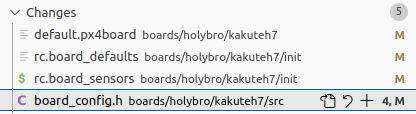

# PX4 support

Please check latest announcements from ModalAI: [https://docs.modalai.com/modal-esc-px4-user-guide/](https://docs.modalai.com/modal-esc-px4-user-guide/)

# Modifications required for kakuteh7 boards with PX4 >1.14

Files need to be changed:

These files are availabe for direct copy under 'assets' folder.

# Hardware connections

The ESC is connected using serial port to Kakuteh7 through ttyS3 according to the following mapping:

Reference: [https://docs.px4.io/main/en/flight_controller/kakuteh7.html](https://https://docs.px4.io/main/en/flight_controller/kakuteh7.html)
