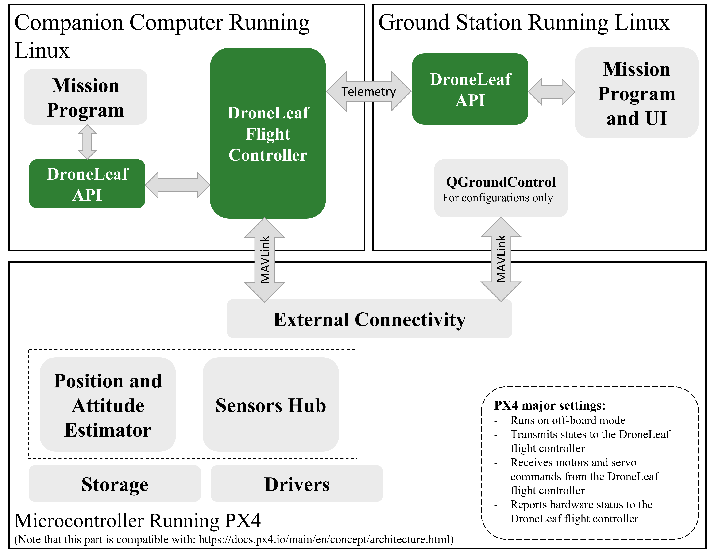

# Frequently Asked Questions
- [Frequently Asked Questions](#frequently-asked-questions)
  - [General](#general)
    - [Who is DroneLeaf for?](#who-is-droneleaf-for)
    - [What does a flight controller do?](#what-does-a-flight-controller-do)
    - [What does DroneLeaf flight controller do?](#what-does-droneleaf-flight-controller-do)
  - [Integration](#integration)
    - [What is DroneLeaf archeticture in a glance?](#what-is-droneleaf-archeticture-in-a-glance)
    - [What is DroneLeaf API?](#what-is-droneleaf-api)
    - [What is DroneLeaf recommended hardware setup?](#what-is-droneleaf-recommended-hardware-setup)
  - [Mission](#mission)
    - [What is the 'Mission Program' software?](#what-is-the-mission-program-software)
    - [Does DroneLeaf support the development of custom mission software?](#does-droneleaf-support-the-development-of-custom-mission-software)
    - [What does the development lifecycle of a custom project look like?](#what-does-the-development-lifecycle-of-a-custom-project-look-like)
  - [Capabilities](#capabilities)
    - [What simulator does DroneLeaf use for verification and validation?](#what-simulator-does-droneleaf-use-for-verification-and-validation)
    - [How can I use DroneLeaf simulator?](#how-can-i-use-droneleaf-simulator)
    - [Does DroneLeaf support vision-based missions?](#does-droneleaf-support-vision-based-missions)

## General
### Who is DroneLeaf for?
DroneLeaf flight controller is tailored to serve autonomous unmanned aerial vehicles (UAV) developers. There is a significant effort involved until the first flight of the custom platform is acheived. Those efforts distacts UAV developers focus on delivering unique value. DroneLeaf reliefs developers by providing an eco-system for automating UAV development and commissioning.

### What does a flight controller do?
The UAV flight requires a tight coordination between guidance, navigation, and control (GNC) modules. The GNC functionalities are provided by the flight control system which typically runs onboard. A short description of each of the GNC modules is presented here for convinience:

- **Guidance:** concerned with generating feasable trajectory for the UAV mission.
- **Navigation:** provides a best estimate of the UAV states, and possibly the state of nearby environment.
- **Control:** tries to achieve the desired trajectories generated by the guidance module using the estimated states from the navigation module.

### What does DroneLeaf flight controller do?
DroneLeaf flight controller automates the process of control design which significantly reduces required resources for development and enhances safety. 

The Navigation stack currently used is the one offered by PX4, and DroneLeaf can assist in setting it up.

Guidance, or trajectory generation, is currently available for multirotor UAVs only.

## Integration

### What is DroneLeaf archeticture in a glance?
DroneLeaf supports the archeticture shown in the figure below. Running DroneLeaf on embedded Linux environement is a major decision that allows complex integration for future-proof flight control capabilities.

### What is DroneLeaf API?
DroneLeaf API is a set of ROS topics and services, and configuration files that are necessary for interfacing with high-level user defined mission.

### What is DroneLeaf recommended hardware setup?
DroneLeaf can work on plenty of hardware that adheres to the general archeticture. Yet the recommended compact hardware is Pixhawk RPi CM4 Baseboard from Holybro.

## Mission

### What is the 'Mission Program' software?
There are two mission programs that the client needs to write (refer to DroneLeaf archeticture figure): One running onboard the UAV and the other one running on the ground station. These programs are essential to tell the UAV what to do and they represent the high-level mission that the UAV needs to perform.

The onboard mission program runs synchronous and asyncronous low-latency task, e.g. guidance or fault recovery. 

The mission program running on the ground station runs asyncronous mission tasks like receiving operator input. It also run synchronous streams that are used to display UAV states like current position.

### Does DroneLeaf support the development of custom mission software?
Yes. DroneLeaf will require a list of clearly defined business requirements for the development of custom mission programs.

### What does the development lifecycle of a custom project look like?
The development lifecycle may vary based on current project status and complexity of the final mission. There are six main steps involved:
- Feasibility study, consultation on design, and componenets selection.
- Propulsion system test and characterization.
- Preliminary tests and characterization on a test-rig.
- Simulation based design, verification and validation.
- Small-scale safe-environment flight tests and characterization.
- Full-scale deployment-environment flight tests.

## Capabilities

### What simulator does DroneLeaf use for verification and validation?
DroneLeaf uses a propreitery custom-built high-fidelity simulator for verification and validation.

### How can I use DroneLeaf simulator?
The DroneLeaf simulator is accessable through the DroneLeaf API. The simulator is tailored towards the specific dynamics of your platform.

### Does DroneLeaf support vision-based missions?
DroneLeaf does support vision-based takeoff, landing, and navigation in structured environments with visual landmarks.