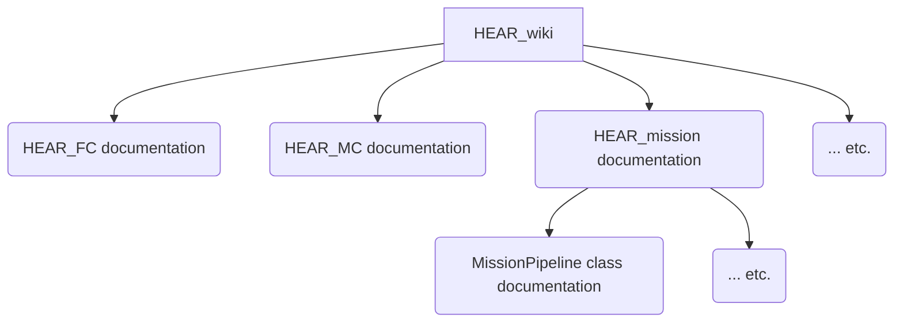

# HEAR Development Getting Started Guide

## How to setup your development environment

Clone `HEAR_CLI`, `HEAR_Configurations` and `HEAR_Docker` directly to your home directory.

Install `HEAR_CLI` based on the instructions provided in it.

using `hear-cli local_machine run_program` command, run the programs:
1) `hear_docker_sitl_full_system_install`
2) 

## How the code is documented?

Documentation is defined here as all meta-information beyond the compiled code. This would include the programming language, e.g. variable names, and how the code is structured. The documentation follows the illustrated three-layers hirearchy:

So we have in general three layers (+ the code itself):

 1. Entry point: which is `HEAR_wiki`. Anyone who wants to start development for HEAR must be referred to `HEAR_wiki`. 

 2. Documentation of repositories: This would include **'Overview'** section at the beggining + four parts:
    1. **How to setup**. This must include all dependent packges. 
       1. **Note 1**: If a package is used by the submodule repo then the installation instructions must be inside the submodule. E.g. pcap package is used by HEAR_util, which is a submodule in HEAR_FC and HEAR_MC, then its installation instructions must be inside HEAR_util but neither in HEAR_FC nor HEAR_MC. 
       2. **Note 2**: if a package is needed by multiple repos then document it in one of them, and reference it in the other repos. DO NOT DOCUMENT TWICE!
    2. **How to run**. Only applicable to runnable repos like HEAR_FC, HEAR_MC, and PX4-Autopilot. It must document running in:
       1. **Development environment**: e.g. your own PC.
       2. **Deployment environment**: e.g. RPi or Jetson, etc.
       3. Or any other environment that would be added in the future. 
    3. **Contributing**: how to extend the code functions with `hello world` examples.
    4. **How to debug**. Documents how to use developer tools for effective debugging, and common troubleshooting tips.

      *Note:* Place the media files used in the documentation under a folder named `Media`.

 3. Comments on the code itself. We use doxygen to support IDE help and auto-generation. Only comment the following:
    1. how to use certain class. For example how to use System.hpp
    2. Reasons for writing certain system code or complex logic you borrowed from some other source. Simply add urls for all sources used. For example why certain network socket options were used: include url of relevant man-pages or PX4 documentation.
 4. The code it self. It must be self-explanatory and it must adhere to the [coding guideline](coding_guideline.md).

**Important**: Documentation is a liability that we want to minimize. Document using stage 4 above, if not possible, document using stage 3, then stage 2, and last stage 1.

**Rule 1**: Documentation must have full coverage: no hidden parameters or manual configurations must go undocumented.

**Rule 2**: Documentation must have zero duplications, including that it must not document the obvious.

## Before you code!

 1. Make sure you read all the relevant development guidelines.
 2. Check existing code base for the functionality you want.
 3. Make sure you have discussed the proposed changes with the respective repo manager.
 4. Use [the common developer setup](developer_toolkit.md).

## After you code

 1. Review your changes. Make sure you adhered to the [coding guideline](coding_guideline.md).
 2. Document your changes. Add any new dependencies as in the [adding dependency guideline](adding_dependencies.md). 

## Repositories structuring
Please see [source management](source_management.md)

## Software Developer Roles
Having developer roles helps segregating responsibilities and smooth code integration.

### Architecture Developers
Responsibilities:
 1. Add/Modify core architectural elements
 2. Add/Modify communication interfaces

Direct clients served:
 1. Algorithms Developers
 2. Application Developers

Current Developers:
1. Mohamad Chehadeh. github id: MChehadeh
2. Ahmed Hashim. github id: ahmed-hashim-pro

### Algorithms Developers

Responsibilities:
 1. Add/Extend blocks, mission elements, utility functions for blocks and mission elements.
 2. Add/Extend communication interfaces, and data types.

Direct clients served:
 1. Application Developers

Current Developers:
1. Abdulla Ayyad. github id: abdullaayyad96
2. Hazem Elrefaei: github id: HazemElrefaei

### Application Developers

Responsibilities:
 1. Add/Extend systems.
 2. Test in simulation and real-world.

Direct clients served:
 1. End-users

Current developers:

1. Hazem Elrefaei: github id: HazemElrefaei
2. Muhammad Kamal: github id: Mu99-M

## Highlighted WiKi Guides:
- [SITL Installation on Ubuntu 20.04](Guide/HEAR%20Software/Operation/SITL/readme.md)
- [Petal App Manager Documentation](https://droneleaf.github.io/petal-app-manager/).

# Copyright

Copyright © 2022 KHALIFA UIVERSITY FOR SCIENCE & TECHNOLOGY (KU). All rights reserved.

Redistribution and use of the SOFTWARE, with or without modification, are permitted for Academic and Scholarly purposes only and not intended for commercial or business purposes; provided that the following conditions are met:

1. Redistributions of SOFTWARE must retain the above copyright notice, this list of conditions and the following disclaimer.

2. Redistributions in binary form must reproduce the above copyright notice, this list of conditions and the following disclaimer in the documentation and/or other materials provided with the distribution.

THIS SOFTWARE IS PROVIDED BY THE COPYRIGHT HOLDER AND CONTRIBUTORS "AS IS" AND ANY EXPRESS OR IMPLIED WARRANTIES, INCLUDING, BUT NOT LIMITED TO, THE IMPLIED WARRANTIES OF MERCHANTABILITY AND FITNESS FOR A PARTICULAR PURPOSE ARE DISCLAIMED. IN NO EVENT SHALL THE COPYRIGHT OWNER OR CONTRIBUTORS BE LIABLE FOR ANY DIRECT, INDIRECT, INCIDENTAL, SPECIAL, EXEMPLARY, OR CONSEQUENTIAL DAMAGES (INCLUDING, BUT NOT LIMITED TO, PROCUREMENT OF SUBSTITUTE GOODS OR SERVICES; LOSS OF USE, DATA, OR PROFITS; OR BUSINESS INTERRUPTION) HOWEVER CAUSED AND ON ANY THEORY OF LIABILITY, WHETHER IN CONTRACT, STRICT LIABILITY, OR TORT (INCLUDING NEGLIGENCE OR OTHERWISE) ARISING IN ANY WAY OUT OF THE USE OF THIS SOFTWARE, EVEN IF ADVISED OF THE POSSIBILITY OF SUCH DAMAGE.
