# DroneLeaf Software Stack
Welcome to the DroneLeaf software stack!

This documentation is the **master entry point** for all things DroneLeaf.  
It is primarily targeted at **developers** who want to contribute to the DroneLeaf software stack.

## Anatomy of the software stack

There are two primary stages of operation:
1. **Commissioning** – a web-driven process, coordinated with the edge device.
2. **Flight** – the actual process of flying the drone.
> in the anatomy diagrams below, we highlight the components involved in each stage. Common components are shown under shared sections.

And there are two types of environments:
1. **Deployment**: where real flights happen. Edge devices run the full software stack on physical hardware.
2. **Development**: where the stach runs on the developer machine. It can run in two ways:
    - **Simulation in the loop (SITL)**: Simulates a real drone visually allowing for safe and convenient testing. It uses PX4 Autopilot and Gazebo simulator.
    - **Bench**: uses a physical pixhawk hardware.

<!-- https://chatgpt.com/share/69142062-1618-8002-8b69-7ab6486b046c -->

The Deployment setup anatomy is given by the following diagram:


The Development SITL setup anatomy is given by the following diagram:


And finally, the Development Bench setup anatomy is given by the following diagram:

<!-- ToDo: include PX4 and dynamodb in commissioning stage -->

### Definitions of used terms
- **PX4 Autopilot**: A stripped down and customized version of the open-source PX4 flight control software.  
- **QGroundControl (QGC)**: A DroneLeaf customized version of the known open-source QGroudnControll software for managing and monitoring drones. The terms LeafMC and QGC are used interchangeably in the documentation.
- **LeafFC**: DroneLeaf's ROS-based flight controller software that interfaces with the PX4 Autopilot to manage drone operations and sensor data. It replaces the traditional PX4 flight controller functionalities with DroneLeaf-specific features and integrations.
- **Petal App Manager**: A Python-based application that manages additional functionalities and applications (petals) on the DroneLeaf edge device, enhancing its capabilities during flight operations. Get more info at: https://droneleaf.github.io/petal-app-manager/getting_started/quickstart.html 
- **leafSDK [SDK]**: With focus on drones mission, it refers to a set of software development tools and libraries that allow developers to create applications and functionalities that interact with the drone's flight controller and other components. 
- **Mavlink-router**: A service that routes MAVLink messages between different endpoints, such as the flight controller, ground control station, and other components. It ensures efficient communication within the DroneLeaf software stack.
- **Dynamodb**: A NoSQL database service provided by AWS, used by DroneLeaf for storing various data related to drone operations, configurations, and telemetry.
- **Developer machine**: The PC or laptop used by developers to write, test, and debug code. It typically runs Ubuntu 20.04 LTS for DroneLeaf development.
- **Bench**: A development mode where a physical Pixhawk hardware is used instead of SITL. It allows for testing with real hardware while still being in a controlled environment.
- **SITL**: Software In The Loop. A simulation mode where the drone's flight controller software runs in a simulated environment, allowing for safe and convenient testing without physical hardware.
- **Edge device**: The onboard computer installed on the drone that runs the full DroneLeaf software stack during actual flight operations. Usually a Jetson or Raspberry Pi.
- **Commissioning**: The process of preparing a drone for operation, which includes provisioning the edge device, configuring settings, licensing, and connecting it to the DroneLeaf cloud services. 
- **Licensing**: The process of obtaining and managing licenses for using DroneLeaf software and services. Reffer to the main website for more info: https://droneleaf.io/pricing

### Additional tools and directories

- **HEAR_CLI**: A centralized management tool and set of codes for HEAR software. Read more at: [Guide/HEAR Software/HEAR_CLI/README.md](./Guide/HEAR%20Software/HEAR_CLI/README.md)

## Getting started with Deployment (Targeted for DroneLeaf clients)
To get started with deployment, please refer to the following guide: [DroneLeaf KnowledgeBase](https://droneleaf.github.io/knowledgebase/)

## Getting Started with Development 
Development in the SITL environment involves working with four stacks:

- **Flight stack:** represented by the software-stack repo. [DroneLeaf/software-stack/tree/dev-sitl](https://github.com/DroneLeaf/software-stack/tree/dev-sitl)
- **Petals stack:** a python code base for added value functionality. [DroneLeaf/petal-app-manager](https://github.com/DroneLeaf/petal-app-manager)
- **Controller dashboard:** a gateway application serving as the critical bridge between our cloud services and drone operations [DroneLeaf/Controller_Dashboard](https://github.com/DroneLeaf/Controller-Dashboard)
- **Web client application [fly.droneleaf.io](https://fly.droneleaf.io):** client interface for drone management and monitoring. [DroneLeaf/DroneLeaf_WebClient_With_Amplify](DroneLeaf/DroneLeaf_WebClient_With_Amplify)

### Preparing the Developer Machine
#### Prerequisites

- **OS:** Ubuntu 20.04 LTS
- **Hardware:** at least 16 GB RAM, 4-core CPU (x86_64/AMD64), and 256 GB free disk space

#### OS Installation

Follow the instructions to [set up a fresh Ubuntu 20.04 on your development machine](./Guide/Hardware%20and%20Process/Development%20Machine%20Preparation/installation_steps_for_Ubuntu_20.04_LTS.md).


#### Tools and Packages Installation
You will need to install the following tools and packages to get started with development:

##### Developer tools

- vscode and extensions installation guide: [Guide/External Software/VSCode/README.md](./Guide/External%20Software/VSCode/README.md)
- Yakuake installation and configuration guide: [Guide/External Software/Yakuake/README.md](./Guide/External%20Software/Yakuake/README.md)


##### HEAR-CLI
- Install HEAR_CLI: [Guide/HEAR Software/HEAR_CLI/README.md](./Guide/HEAR%20Software/HEAR_CLI/README.md). 
ToDo: how to setup section reference0


##### Dependency Packages
-   apt packages:

```bash
sudo apt install -y build-essential libdbus-glib-1-dev libgirepository1.0-dev \
git curl wget cmake unzip pkg-config libssl-dev libjpeg-dev libpng-dev \
libtiff-dev libusb-1.0-0-dev python3-pip jq
```
-   python3 packages:

```bash
pip3 install --force-reinstall ninja
pip3 install testresources
pip3 install kconfiglib
pip3 install --user jsonschema
pip3 install --user pyros-genmsg
pip3 install --user jinja2
```

##### HEAR Software Stack Installation
- Follow HEAR_CLI based installation scripts as per [SITL installation guide](./Guide/HEAR%20Software/Operation/SITL/sitl-installation-on-ubuntu20.04.md)


### Getting Started with Flight Stack Development
Now that you have set up your development machine and installed the HEAR software stack, you can start developing and contributing to the flight stack.


#### Cloning
```bash
hear-cli local_machine run_program --p software_stack_clone
## When prompted for a branch:
## - Use `dev-sitl` for active development
## - Use `main` for the latest stable release
```

#### Compilation
The following components can be built from source for development purposes:

##### HEAR_Msgs
```bash
cd ~/software-stack/HEAR_Msgs
## optional: clean build
## rm -rf devel/ build/
catkin_make
source devel/setup.bash   ## sets up ROS environment and package paths
```

##### LeafFC
> In clean build, redo the HEAR_Msgs build step first.
```bash
cd ~/software-stack/HEAR_FC
## optional: clean build
## rm -rf devel/ build/
catkin_make -DCMAKE_BUILD_TYPE=Debug -DHEAR_TARGET=SITL
source devel/setup.bash   ## sets up ROS environment and package paths
## Launching the flight controller 
roslaunch flight_controller px4_flight_mavlink_opti_onboard_mission.launch
```

##### PX4 Autopilot
```bash
cd ~/software-stack/PX4-Autopilot
bash ./Tools/setup/ubuntu.sh
make px4_sitl gazebo-classic
## Alt: make px4_sitl gazebo-classic_dfl, or HEADLESS=1 ...
```
> Note: Gazebo Classic window should open automatically.

##### LeafMC
- Follow the instructions in [LeafMC Guide](./Guide/HEAR%20Software/LeafMC/README.md) to set up LeafMC for development.

### Getting Started with Petals Stack Development 
Check the repo wiki at [https://droneleaf.github.io/petal-app-manager/](https://droneleaf.github.io/petal-app-manager/)

> for quick start, follow the instructions at [https://droneleaf.github.io/petal-app-manager/getting_started/quickstart.html](https://droneleaf.github.io/petal-app-manager/getting_started/quickstart.html)

### Getting Started with Controller Dashboard Development 
Check the repo README at [DroneLeaf/Controller_Dashboard](https://github.com/DroneLeaf/Controller-Dashboard)


### Getting Started with Web Client Application Development 
Check the repo README at [DroneLeaf/DroneLeaf_WebClient_With_Amplify](https://github.com/DroneLeaf/DroneLeaf_WebClient_With_Amplify)

## Commissioning:
The commissioning process is important in DroneLeaf's software stack as it:
- Binds the drone hardware or SITL instance to a DroneLeaf account.
- Configures initial settings and parameters for flight operations.
- Allows tuning and calibration of sensors before flight.
- Allows mission planning, uploading and monitoring.

Commissioning is divided into these sections:
- provisioning
- configuration
- licensing
- tuning and calibration
- cloud synchronization

Follow the provisioning steps explained in [Quick Commissioning Guide](./Guide/HEAR%20Software/Operation/SITL/quick_commissioning_guide.md)

## Running the SITL/bench environment
Follow these steps to run the full SITL environment after installation and commissioning:
> Steps differ slightly between SITL and Bench setups:
    - **SITL (simulator):** start with step 1.
    - **Bench (hardware):** start from step 2, as the physical pixhawk handles PX4 execution.

> Commissioning must be completed before running the SITL/bench environment.

### 1. Build and launch PX4 (Gazebo Classic):

> **SITL only:** perform this step only when running the simulator (SITL).

```bash
cd ~/software-stack/PX4-Autopilot
make px4_sitl gazebo-classic
```

### 2. Start the mavlink-router service:

```bash
sudo systemctl start mavlink-router.service
```

### 3. Launch HEAR_FC:

```bash
cd ~/software-stack/HEAR_FC
source devel/setup.bash   ## sets up ROS environment and package paths
roslaunch flight_controller px4_flight_mavlink_opti_onboard_mission.launch
```

### 4. Launch LeafMC:

- From Qt Creator (recommended for development).
- Or use the AppImage from the software-stack releases: https://github.com/DroneLeaf/software-stack/releases

### 5. Petal App Manager:

- If provisioning is not complete, complete it first as per the [First Run guide](./Operation/SITL/First_Run_guide.md).
- Launch Petal App Manager as per the official quickstart: https://droneleaf.github.io/petal-app-manager/getting_started/quickstart.html

## Debugging Tools
### Debugging MAVLink with Wireshark
<!-- /home/yo/HEAR_wiki/Guide/External Software/MAVLink/mavlink_debugging.md -->
To debug MAVLink messages, reffer to the following guide: [Guide/External Software/MAVLink/mavlink_debugging.md](./Guide/External%20Software/MAVLink/mavlink_debugging.md)

<!-- ## Hardware guides
ToDo: include hardware guides links here. -->

## Additional Functionalities
### VPN remote access
Read more about setting up VPN remote access in the following guide: [Guide/Hardware and Process/Development Machine Preparation/vpn_remote_access_setup.md](./Guide/Hardware%20and%20Process/Development%20Machine%20Preparation/vpn_remote_access_setup.md)


## Contribution and development
- Hear-cli development guide: [Guide/HEAR Software/Development/hear-cli-development-guide.md](./Guide/HEAR%20Software/Development/hear-cli-development-guide.md)
- LeafMC and Qt tooling guide: [Guide/HEAR Software/Operation/SITL/leafQGC-and-QT-tooling.md](./Guide/HEAR%20Software/Operation/SITL/leafQGC-and-QT-tooling.md)
- leafFC development guide: [Guide/HEAR Software/Operation/SITL/DynamoDB-and-hearfc-debugging.md](./Guide/HEAR%20Software/Operation/SITL/DynamoDB-and-hearfc-debugging.md)
- software-stack development guide: [Guide/HEAR Software/Development Workflow/software_development_and_releasing_workflow.md](./Guide/HEAR%20Software/Development%20Workflow/software_development_and_releasing_workflow.md)
- petal app manager development guide: [https://droneleaf.github.io/petal-app-manager/contributing/contribution_guide.html](https://droneleaf.github.io/petal-app-manager/contributing/contribution_guide.html)

## Known Issues
Check the [Known Issues](./Operation/SITL/known_issues.md) document for a list of current issues and workarounds.