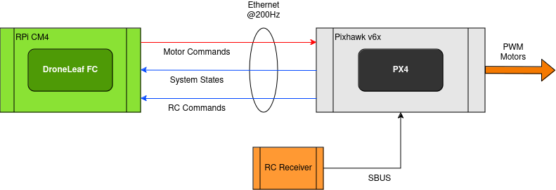
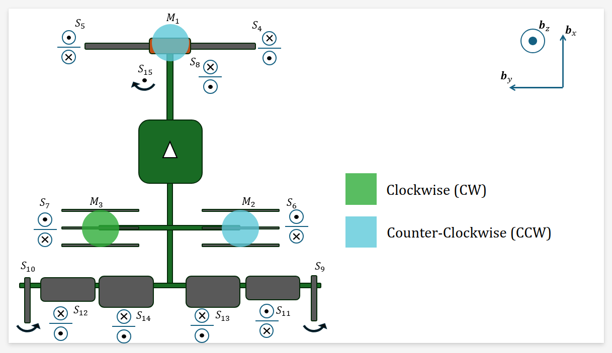
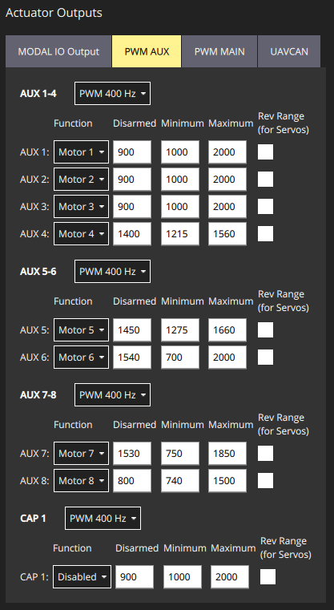
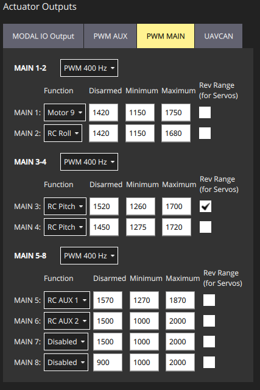
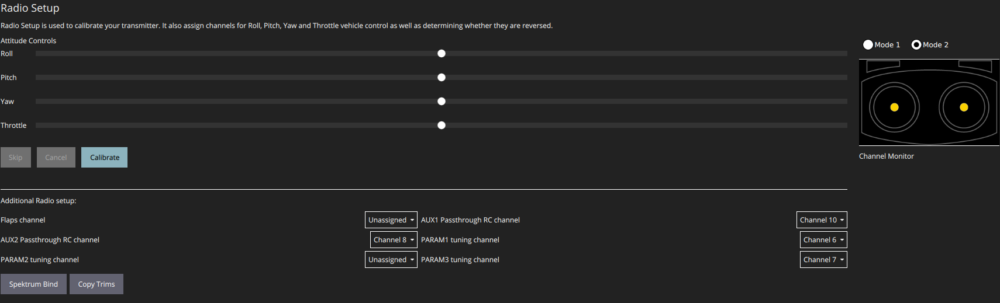

# Manual Transition Flight Design Sketch

The general system archeticture is given as follows:

# Taxonomy
FB: Feedback action. Output of the feedback control system from within DroneLeaf FC. 

FF: Feedforward action (i.e. open-loop). Output of the feedforward system from within DroneLeaf FC.

RC-D: commanded directly through RC. Configured in PX4 and NOT passed to DroneLeaf FC.

We refer to RC inputs as CH|x| with x being the channel number. 
Parameters HEAR-|A||x|, HEAR-|B||x|, etc. are tunable parameters in HEAR FC with x being optional parameter index, A and B are arbitrary captions to organize parameters set.

Parameters PX4-|A||x| are tunable parameters in PX4 with x being optional parameter index, and A is arbitrary caption to organize parameters set.

# Convention
This convention is what to expect when moving knobs in QGroundControl after performing all PX4 settings mentioned below.

# PX4 Settings
## Physical Asset assignment
| **Reference** | **Function**  | **Pixhawk Pin** | **Signal Source**  |
|---------------|---------------|-----------------|--------------------|
| **M1**        | Front Motor   | AUX 1           | OFFBOARD MAVLink 1 |
| **M2**        | Rear Motor R  | AUX 2           | OFFBOARD MAVLink 2 |
| **M3**        | Rear Motor L  | AUX 3           | OFFBOARD MAVLink 3 |
| **S4**        | Canard R      | AUX 4           | OFFBOARD MAVLink 4 |
| **S5**        | Canard L      | AUX 5           | OFFBOARD MAVLink 5 |
| **S6**        | Vane R        | AUX 6           | OFFBOARD MAVLink 6 |
| **S7**        | Vane L        | AUX 7           | OFFBOARD MAVLink 7 |
| **S8**        | M1 Tilt Servo | AUX 8           | OFFBOARD MAVLink 8 |
| **S9**        | Rudder R      | MAIN 1          | OFFBOARD MAVLink 9 |
| **S10**       | Rudder L      | MAIN 1          | OFFBOARD MAVLink 9 |
| **S11**       | Aileron R     | MAIN 2          | RC ROLL            |
| **S12**       | Aileron L     | MAIN 3          | RC ROLL            |
| **S13**       | Elevator R    | MAIN 4          | OFFBOARD MAVLink 10|
| **S14**       | Elevator L    | MAIN 5          | OFFBOARD MAVLink 11|
| **S15**       | Steering      | MAIN 6          | RC AUX 1           |
| **S16**       | Door RF       | MAIN 7          | RC AUX 2           |
| **S17**       | Door RR       | MAIN 7          | RC AUX 2           |
| **S18**       | Door LF       | MAIN 7          | RC AUX 2           |
| **S19**       | Door LR       | MAIN 7          | RC AUX 2           |

## Actuation PX4 settings
Maximum/Minimum limits for each actuator are set in the QGC. See QGC screenshots below.

## RC PX4 settings

# RC Settings
Used Controller is Futaba T14SG.
## RC Channel assignment
See `Systems/RC/general.json` for updated HEAR configuration.

| **RC Channel** | **PX4 Assignment** | **Used in HEAR FC** | **Futaba T14SG Assignment** |
|----------------|--------------------|---------------------|-----------------------------|
| **CH1**        | RC ROLL            | Yes                 | J1                          |
| **CH2**        | RC PITCH           | Yes                 | J2                          |
| **CH3**        | RC THROTTLE        | Yes                 | J3                          |
| **CH4**        | RC YAW             | Yes                 | J4                          |
| **CH5**        |                    |                     |                             |
| **CH6**        |                    | Yes (CH_number_for_forward_motion)   | RS                          |
| **CH7**        |                    |                     |                             |
| **CH8**        | RC AUX 2           | Yes (CH_number_for_switch_vtol_mode)                | SA                          |
| **CH9**        |                    |                     |                             |
| **CH10**       | RC AUX 1           |                     | LD                          |
| **CH11**       | Kill switch        |                     | SF                          |
| **CH12**       |                    |                     |                             |

## RC Settings

# Known Issues
## Issue #1: RC inputs and servo outputs are not in SI units.

**Proposed solution:** prepare a calibration and trimming procedure based on manual angle measurements. Manually obtained angle measurements + angle specifications are input into `HEAR_Configurations`. A special subsystem in `RC_OrientationThrustControlSystemVTOL` picks up angle specifications and updates all `RC_OrientationThrustControlSystemVTOL` parameters accordingly.

# Surfaces and Servos calibration
## Calibration values

| Actuator 	| Positive Set Angle Limit 	| Negative Set Angle Limit 	| Positive Mechanical Limit 	| Negative Mechanical Limit 	| PWM at the Positive Set Angle 	| PWM at the Negative Set Angle 	| PWM at the Positive Mechanical Limit 	| PWM at the Negative Mechanical Limit 	| Zero Angle Reference wrt datum 	|
|----------	|--------------------------	|--------------------------	|---------------------------	|---------------------------	|-------------------------------	|-------------------------------	|--------------------------------------	|--------------------------------------	|--------------------------------	|
| S6       	| 30                       	| 30                       	|                           	|                           	|                               	|                               	|                                      	|                                      	|                                	|
| S7       	| 30                       	| 30                       	|                           	|                           	|                               	|                               	|                                      	|                                      	|                                	|
| S8       	| 7                        	| 33                       	|                           	| 11                        	|                               	|                               	|                                      	|                                      	|                                	|
| S11      	| 22                       	| 22                       	|                           	|                           	|                               	|                               	|                                      	|                                      	|                                	|
| S12      	| 22                       	| 22                       	|                           	|                           	|                               	|                               	|                                      	|                                      	|                                	|
| S13      	| 18                       	| 18                       	|                           	|                           	|                               	|                               	|                                      	|                                      	|                                	|
| S14      	| 18                       	| 18                       	|                           	|                           	|                               	|                               	|                                      	|                                      	|                                	|
* For PWM limits corresponding to the physical angle limits, refer to the PX4 actuator settings panes above.
* All angles are in degrees.

## Datum reference

| Datum reference 	| Image 	| Comments 	|
|-----------------	|-------	|----------	|
| Main Chassis    	|       	|          	|
| Rear Wing       	|       	|          	|

