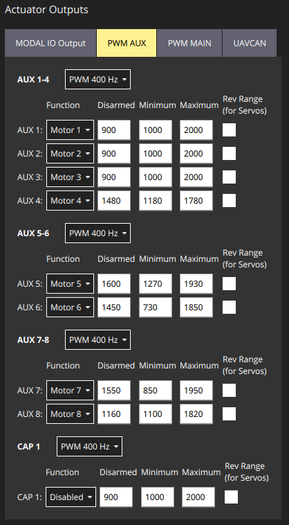
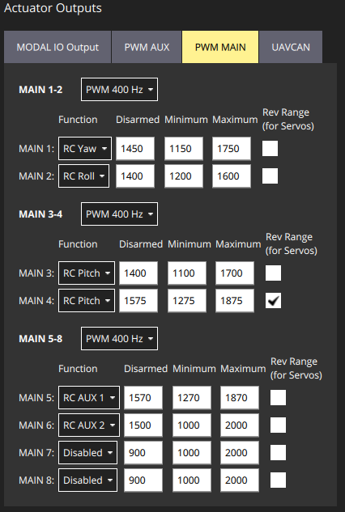

# Manual Transition Flight Design Sketch

### Taxonomy
We refer to RC inputs as CH[\x] with x being the channel number. 
Parameters HEAR-[\A][\x], HEAR-[\B][\x], etc. are tunable parameters in HEAR FC with x being optional parameter index, A and B are arbitrary captions to organize parameters set.

Parameters PX4-[A][x] are tunable parameters in PX4 with x being optional parameter index, and A is arbitrary caption to organize parameters set.

FB: Feedback action

FF: Feedforward action (i.e. open-loop)

RC-D: commanded directly through RC.

### General
Let CH8 be the mode selection switch, pos 1 (low): VTOL mode; pos 2 (mid or high): plane mode. 
Safety: CH11 is kill switch
Minimum M1 command must prevent ESC stall.
Speed is obtained from pitot tube and GPS.

### HEAR Tunable parameters

#### FWD_RANGE_ANGLE_RAD_EXTREMUM:

corresponding variable in code snippet : extremum_angle

    if (vtol_mode==0){ // Multirotor
        _commands[0]=_commands[0] /cos(_u[4]*extremum_angle); // This assumes map_for_fwd range is -1 <-> 1
    }

#### PITCH_CANARD_RANGE_MAX:

    auto gain_pitch_canard_range_max=new Gain<float>();
    gain_pitch_canard_range_max->setGain(pitch_canard_range_max);

    // Pitch
    this->connect(demux_ori_des->getOutputPort<float>(Demux3::OP::Y), gain_pitch_canard_range_max->getInputPort<float>());
    this->connect(gain_pitch_canard_range_max->getOutputPort<float>(), mux_angle_u->getInputPort<float>(Mux3::IP::Y));

#### YAW_CANARD_DIFF_RANGE_MAX:

    auto gain_yaw_canard_diff_range_max=new Gain<float>();
    gain_yaw_canard_diff_range_max->setGain(yaw_canard_diff_range_max);

    // Yaw
    this->connect(demux_ori_rate_des->getOutputPort<float>(Demux3::OP::Z), gain_yaw_canard_diff_range_max->getInputPort<float>());
    this->connect(gain_yaw_canard_diff_range_max->getOutputPort<float>(), mux_angle_u->getInputPort<float>(Mux3::IP::Z));

### Physical Asset assignment
| **Reference** | **Function**  | **Pixhawk Pin** | **Signal Source**  |
|---------------|---------------|-----------------|--------------------|
| **M1**        | Front Motor   | AUX 1           | OFFBOARD MAVLink 1 |
| **M2**        | Rear Motor R  | AUX 2           | OFFBOARD MAVLink 2 |
| **M3**        | Rear Motor L  | AUX 3           | OFFBOARD MAVLink 3 |
| **S4**        | Canard L      | AUX 4           | OFFBOARD MAVLink 4 |
| **S5**        | Canard R      | AUX 5           | OFFBOARD MAVLink 5 |
| **S6**        | Vane R        | AUX 6           | OFFBOARD MAVLink 6 |
| **S7**        | Vane L        | AUX 7           | OFFBOARD MAVLink 7 |
| **S8**        | M1 Tilt Servo | AUX 8           | OFFBOARD MAVLink 8 |
| **S9**        | Rudder R      | MAIN 1          | RC YAW             |
| **S10**       | Rudder L      | MAIN 1          | RC YAW             |
| **S11**       | Aileron R     | MAIN 2          | RC ROLL            |
| **S12**       | Aileron L     | MAIN 2          | RC ROLL            |
| **S13**       | Elevator R    | MAIN 3          | RC PITCH           |
| **S14**       | Elevator L    | MAIN 4          | RC PITCH           |
| **S15**       | Steering      | MAIN 5          | RC AUX 1           |
| **S16**       | Door RF       | MAIN 6          | RC AUX 2           |
| **S17**       | Door RR       | MAIN 6          | RC AUX 2           |
| **S18**       | Door LF       | MAIN 6          | RC AUX 2           |
| **S19**       | Door LR       | MAIN 6          | RC AUX 2           |

### Actuation PX4 settings
Maximum/Minimum limits for each actuator are set in the QGC. See QGC screenshots below.

### RC PX4 settings

### RC Channel assignment
See "Systems/RC/general.json" for updated HEAR configuration.

| **RC Channel** | **PX4 Assignment** | **Used in HEAR FC** | **Futaba T14SG Assignment** |
|----------------|--------------------|---------------------|-----------------------------|
| **CH1**        | RC ROLL            | Yes                 | J1                          |
| **CH2**        | RC PITCH           | Yes                 | J2                          |
| **CH3**        | RC THROTTLE        | Yes                 | J3                          |
| **CH4**        | RC YAW             | Yes                 | J4                          |
| **CH5**        |                    |                     |                             |
| **CH6**        |                    | Yes (CH_number_for_forward_motion)   | RS                          |
| **CH7**        |                    |                     |                             |
| **CH8**        | RC AUX 2           | Yes (CH_number_for_switch_vtol_mode)                | SA                          |
| **CH9**        |                    |                     |                             |
| **CH10**       | RC AUX 1           |                     | LD                          |
| **CH11**       | Kill switch        |                     | SF                          |
| **CH12**       |                    |                     |                             |

## VTOL Mode
CH1: Throttle commanding M1, M2, M3 (FF). M1 is the frontal motor.

CH2: Yaw commanding the vanes differentially (FB) (HEAR-YAW_VANES_RANGE_MAX), and canard differentials (FF) (HEAR-YAW_CANARD_DIFF_RANGE_MAX); rudder together (FF) (RC-D).

CH3: Roll commanding M2 and M3 in a differentially (FB), AND ailerons differentially (FF) (RC-D). 

CH4: Pitch commanding M1 and (M2+M3) differentially (FB), elevators together (FF) (RC-D), canard together (FF) (HEAR-PITCH_CANARD_RANGE_MAX). Both elevators and canards are differential (PX4 settings).

CH6: Forward lateral commanding vanes (FF) (range HEAR-FWD_RANGE_MIN - HEAR-FWD_RANGE_MAX | parametrized angles HEAR-FWD_RANGE_ANGLE_RAD_EXTREMUM), frontal servo (FF) (range HEAR-FWD_RANGE_MIN - HEAR-FWD_RANGE_MAX), and canard (canard phase leads frontal servo phase by a factor of HEAR-CANARD_FWD_SCALE >= 1) in the same direction . Frontal servo angle theta modifies M1 thrust by M1=M1*/cos(theta).

## Plane mode

### At the event of transition
The frontal servo drives M1 to HEAR-PLANE_FRT_SERVO_TILT. The canard is also trimmed to HEAR-PLANE_FRT_SERVO_TILT.

M2 and M3 are switched off.

Doors of M2 and M3 closed (RC-D).

Vanes closed HEAR-PLANE_VANES_CLOSED_TILT

### Post-transition control
CH1: Throttle directly commanding M1. No front servo angle compensation.

CH2: Yaw commanding rudder together (FF) (RC-D). 

CH3: Roll commanding ailerons differentially (FF) (RC-D). 

CH4: Pitch commanding elevators together (FF) (RC-D), and canard together (FF) (HEAR-PITCH_CANARD_RANGE_MAX). Both elevators and canards are differential (PX4 settings). 