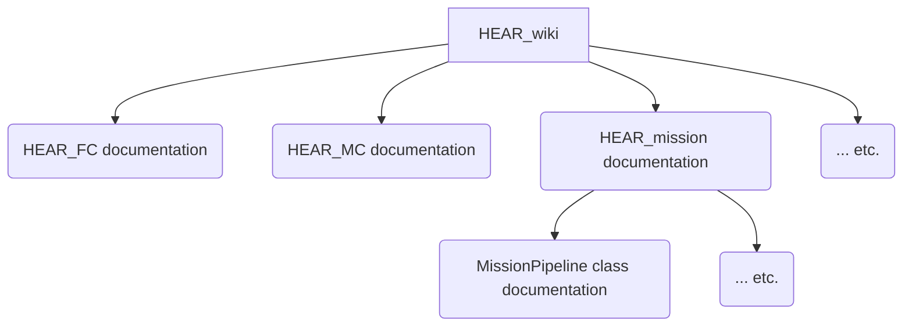

# HEAR Development Getting Started Guide

## How the code is documented?

Documentation is defined here as all meta-information beyond the compiled code. This would include the programming language, e.g. variable names, and how the code is structured. The documentation follows the illustrated hirearchy:

So we have in general three layers:

 1. Entry point: which is `HEAR_wiki`. Anyone who wants to start development for HEAR must be referred to `HEAR_wiki`. 

 2. Documentation of repositories: This would include three parts:
    1. **How to setup**. This must include all dependent packges. 
       1. **Note 1**: If a package is used by the submodule repo then the installation instructions must be inside the submodule. E.g. pcap package is used by HEAR_util, which is a submodule in HEAR_FC and HEAR_MC, then its installation instructions must be inside HEAR_util but neither in HEAR_FC nor HEAR_MC. 
       2. **Note 2**: if a package is needed by multiple repos then document it in one of them, and reference it in the other repos. DO NOT DOCUMENT TWICE!
    2. **How to run**. Only applicable to runnable repos like HEAR_FC, HEAR_MC, and PX4-Autopilot. It must document running in:
       1. **Testing environment**: e.g. your own PC.
       2. **Deployment environment**: e.g. RPi or Jetson, etc.
       3. Or any other environment that would be added in the future. 
    3. **How to debug**. Documents how to use developer tools for effective debugging, and common troubleshooting tips.

 3. Comments on the code itself. We use doxygen to support IDE help and auto-generation. Only comment the following:
    1. how to use certain class. For example how to use System.hpp
    2. Reasons for writing certain system code or complex logic you borrowed from some other source. Simply add urls for all sources used. For example why certain network socket options were used: include url of relevant man-pages or PX4 documentation.

## Before you code!

 1. Make sure you read all the relevant development guidelines.
 2. Check existing code base for the functionality you want.
 3. Make sure you have discussed the proposed changes with the respective repo manager.
 4. Use [the common developer setup](developer_toolkit.md).

## After you code

 1. Review your changes. Make sure you adhered to the [coding guideline](coding_guideline.md).
 2. Document your changes. Add any new dependencies as in the [guideline](adding_dependencies.md). 

## Source Tree Structure at Host
Having the same source tree structure for all developers is quite helpful: it helps avoiding surprises and automating workflows.

Please adhere to the following source tree structure:
(~: user home directory, it must correspond to $HOME environment variable)

~/HEAR_FC

~/HEAR_MC

~/HEAR_SITL

~/HEAR_configurations

~/Rpi_dep

*AA: please add PX4 autopilot*

**Important**: Make sure that all paths within code repos are not specific to your host PC, i.e. relative paths.

**Hint**: Use `getHomeDirectroy()` from UnixEnvHelperFunc.hpp within HEAR_util to avoid absolute links within the code

> When using VSCode make sure paths in .vscode folder are relative

## Repositories structuring

## Software Developer Types
### Architecture Developers
Responsibilities:
 1. Develop core architectural elements
 2. Develop communication interfaces

Clients served:
 1. Algorithms Developers
 2. Application Developers

Current Developers:
1. Mohamad Chehadeh
2. Ahmed Hashem

### Algorithms Developers

### Application Developers

