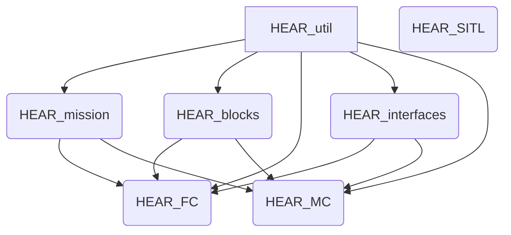

# Source management
**Document Scope**: The git repos used across HEAR and how to handle them.

## HEAR_blocks
This repository contains all source files that inherit from the `Block` class, and all the coding infrastructure that supports Blocks coding paradigm like `System` and `Port` classes. This coding infrastructure is under `Blocks_core` folder.

## HEAR_mission
This repository contains all source files that inherits from the `MissionElement` class, and all the coding infrastructure that supports the Pipeline coding paradigm like `MissionPipeline` and `MissionScenario` classes. This coding infrastructure is under `Mission_core` folder.

## HEAR_util
This repository includes all functionalities that do not fit in the Blocks or Pipeline coding paradigms. Ideally, a functionality must be implemented here first to be encapsulated later by a Block or a MissionElement. For example, a code to write to a file must be written as a function in `HEAR_util` and then this function gets called within a `Block` or a `MissionElement`.

## HEAR_Interfaces
This repository contains all source files that inherits from the `InterfaceController` class and extends `InterfaceFactory` class. The role of this repo is to provide framing/deframing infrastructure of specific protocols and make them ready for consumption within Blocks coding paradigm.

## HEAR_FC
A code repo unifying `HEAR_blocks`, `HEAR_mission` and `HEAR_util` in a way to form a fully functional flight controller.

## [HEAR_MC](https://github.com/HazemElrefaei/HEAR_MC)
A code repo unifying `HEAR_blocks`, `HEAR_mission` and `HEAR_util` in a way to form a fully functional mission management software.

## [HEAR_SITL](https://github.com/MChehadeh/HEAR_SITL)

## [HEAR_ROS_bag_reader]()

## [PX4-AutoPilot]()
This is a re-published (not forked) repo of the original PX4-Autopilot.

## [HEAR_docker]()

## [HEAR_configurations](https://github.com/MChehadeh/HEAR_configurations)

## [DNN_system_ID](https://github.com/abdullaayyad96/DNN_system_ID)

## Source dependency graph (visualize on GitHub or Mermaid)

**Note** the source dependency graph provides a general rule on how code must be written and reused. e.g. try to write in `HEAR_util` first and reuse on other dependent modules. If not then move down the graph, i.e. `HEAR_mission` `HEAR_blocks` or `HEAR_interfaces`, and so on.

**Converse Note** e.g. if you write a code in `HEAR_util` that gets used only in `HEAR_FC` and you do not see that in the future it would be used in any other repo rather than `HEAR_FC`, then that particular code must be removed from `HEAR_util` and be moved to `HEAR_FC`.